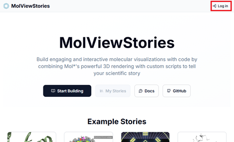
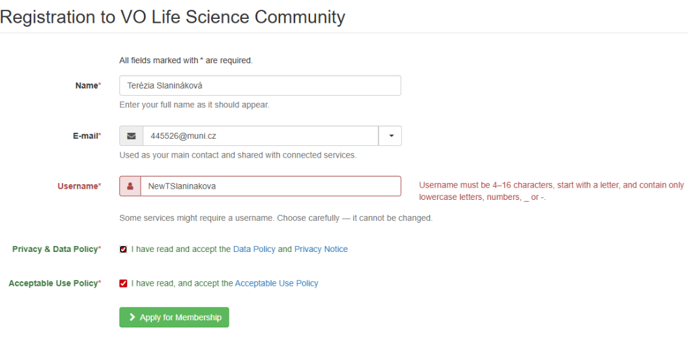

# First Time Login

To use the save and publish features, you need to login. **Logging in is a one-time process and you will not need to login again in the future.**

## 1. Click the login button

This will open a popup window:

You now have multiple options of logging in.

### 2.1. **Recommended:** Login with your institutional credentials

For example, if you are a member of the European Molecular Biology Laboratory you can login with your EMBL credentials:

This redirects you to the login page you already use to access other services of your institution.

Finally, you need to give consent to release your personal infromation (name, surname, email) to mol-view-stories

🟢 **Done!**

Once you have logged in, you will be redirected to the main page of the application.

### 2.2. Login with your Google/GitHub/Apple credentials

If you don't have institutional credentials, you can login with your Google/GitHub/Apple credentials. Below we document how to login first time with GitHub:

#### 2.2.1. Authorize the login provider

#### 2.2.2. Confirm your intention of registering a new account

#### 2.2.3. Create a new account

#### 2.2.4. Consent to the Use Policy

#### 2.2.5. Confirm your membership by clicking a link sent to your email

#### 2.2.6. Give consent to release your personal information (name, surname, email) to mol-view-stories

### 2.3. Login with LifeScience Hostel

Alternatively, you can register an account with LifeScience Hostel.

Next, choose "Sign up" and follow the instructions to create an account.

Next, confirm your membership by clicking a link sent to your email

And finally, give consent to release your personal information (name, surname, email) to mol-view-stories

🟢 **Done!**

## 3. Successful login

Once you have logged in, you will be redirected to the main page of the application and the popup will close.

You can now use the save and publish features.

## 4. Optional: Log out

You can also log out of the application by clicking the logout button in the top right corner of the page:

The next time you log in, the login provider will recognize your account and the login process will be faster.
