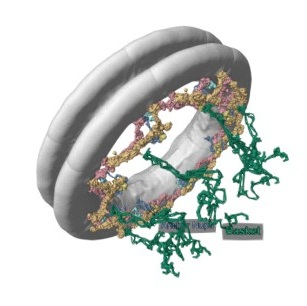
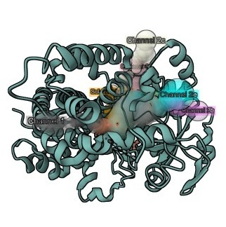

# Example Stories

Here a couple making of several example story we design with molviewstory builder. They can help you better understand molviewspec and how to make great interactive molecular story.

- {width=40} **[MOM1](making-of-mom1.qmd)** 

The first *Molecule of the Month* story on myoglobin by David Goodsell (January 2000) as an interactive, narrated experience. It demonstrates how MolViewSpec scenes combine Markdown, animation, and user interaction to turn a classic scientific article into an explorable molecular story.

- {width=40} **[MOM300](making-of-mom300.qmd)** 

This story adapts the 300th *Molecule of the Month* by David Goodsell (December 2024) on the bacterial flagellar motor into an interactive exploration of one of nature’s most powerful molecular machines. It shows how large multi-protein assemblies, rotational motion, and regulatory switches can be communicated through coordinated text, highlights, and animation.

- {width=40} **[NPC](making-of-npc.qmd)**

This story presents integrative structural models of the yeast nuclear pore complex basket, illustrating how MolViewStories enables the visualization and exploration of large, flexible molecular assemblies.

- {width=40} **[CYP3A4](making-of-cyp3a4.qmd)**

This story turns crystal structures of Cytochrome P450 3A4 into an interactive exploration of ligand binding and substrate access. The story shows how MolViewStories can combine structure superposition, simple animations, and channel visualization. 