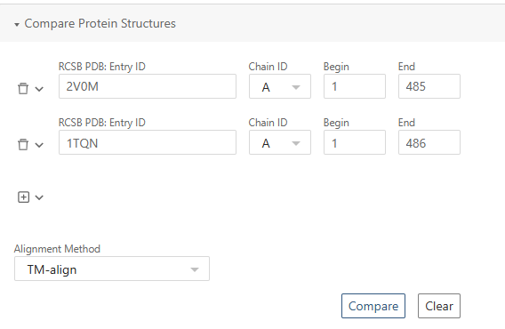
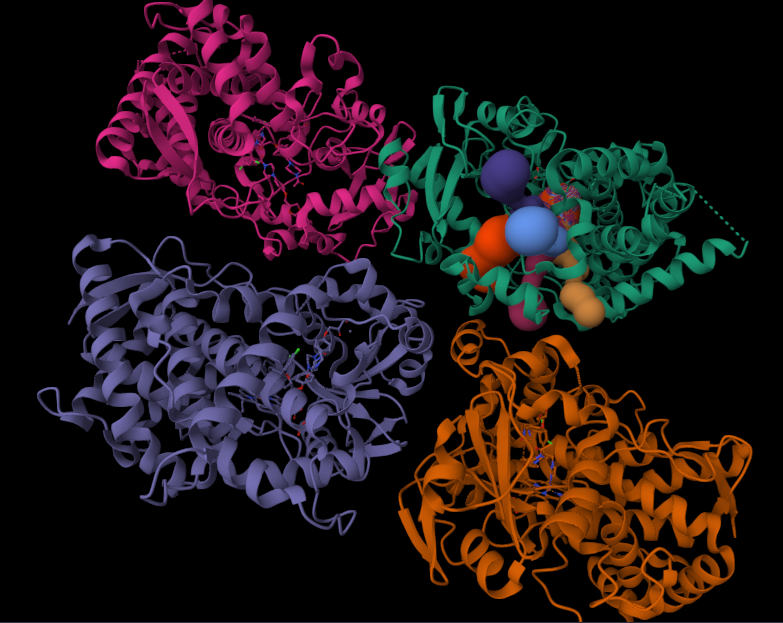
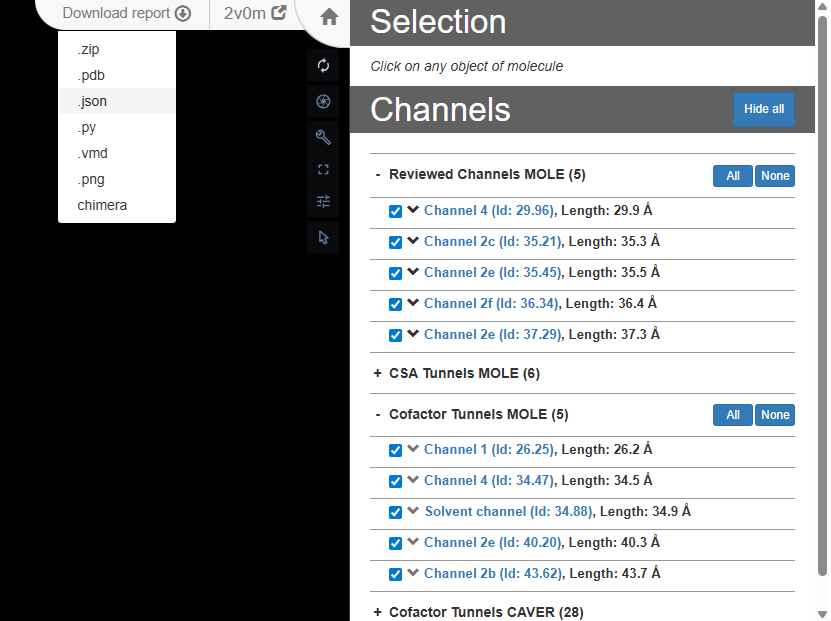

# Making of the Cytochrome P450 3A4
In this tutorial, we build an interactive story to explore the structure of Cytochrome P450 3A4 (CYP3A4) and its ligand access channels using the ligand-bound crystal structure 2V0M. For structural comparison, we also include the ligand-free structure 1TQN to highlight conformational differences associated with ligand binding. Step by step, we show how to load structures, define key structural elements, and visualize channels.

## Assets
In this story we have two assets, which are the structures with PDB IDs [`1TQN`](https://www.rcsb.org/structure/1TQN) and [`2V0M`](https://www.rcsb.org/structure/2V0M) in bcif format.

## Story-Wide Code
We start by configuring the overall appearance of the molecular scene. Enabling an "illustrative" representation with outlines makes the protein structure and especially the channels visually cleaner.
```javascript
builder.canvas({custom:{
  molstar_postprocessing: {
    enable_outline: true
  }}})

```

Next, we define a color styling configuration where atoms are colored based on their chemical element. This styling can be then applied to different selections:
```javascript
const coloring = { custom: {
  molstar_color_theme_name: 'element-symbol'
}}
```
Now let's create two structures from their PDB IDs. 

To enable a direct structural comparison, we align 1TQN onto 2V0M. The transformation matrices used for this alignment were obtained from the [RCSB PDB structure alignment tool](https://www.rcsb.org/alignment). Simply export Transformation matrices (JSON) from the web and then paste them into transfrom function:



```javascript
const _1tqn = builder
.download({ url: '1tqn.bcif'})
.parse({ format: 'bcif' })
.modelStructure()
.transform({
  rotation: [
    0.6552433383, 0.0995189691, 0.748833855,
    0.7497798575, 0.0352069153, -0.6607500574,
    -0.0921212946, 0.9944126145, -0.0515482218,
  ],
  translation: [45.8176089191, 22.9477826026, 65.2697845164],
})
```

We now load the 2V0M structure and define a set of reusable selectors for regions that will be referenced throughout the story (ligands, catalytic core, heme group, and a phenylalanine cluster). The structure contains two ligand molecules. One ligand is coordinated to the heme iron, while the other is located inside the tunnel. We create separate selectors for each case to allow independent visualization and comparison.
```javascript
const _2v0m = builder
.download({ url: '2v0m.bcif'})
.parse({ format: 'bcif' })
.assemblyStructure()

// ketocanozole bound to the Hem
const ligandBound = _2v0m
.component({ selector: [{'label_asym_id': 'F' }]}) 

const ligandNotBound = _2v0m
.component({ selector: [{'label_asym_id': 'G' }]}) 

const catCore = _2v0m
.component({ selector: [{ 'label_seq_id': 420 }, { 'label_seq_id': 287 }]})

const hem = _2v0m
.component({ selector: {'label_asym_id': 'E' }})

const phe = [{ 'auth_seq_id': 213 }, { 'auth_seq_id': 215 }, { 'auth_seq_id': 219 }, { 'auth_seq_id': 220 }, { 'auth_seq_id': 108 }, { 'auth_seq_id': 241 }, { 'auth_seq_id': 304 }] // Phe-cluster
```

To keep the visualization consistent and readable across scenes, we define a centralized color palette for structures and functional regions. We also define the residue ranges corresponding to helices that play an important role in ligand access and channel formation.
```javascript
const colors = {
  '1tqn': '#EDF6F9',  
  '2v0m': '#83C5BE',
  phe:   '#E25B2E',    
  hem:   '#E29578',   
  helix: '#006D77',
  core: '#8C3123',
  ligand: '#4870C6'
}

const helices = {
  "F' helix": { 'beg_auth_seq_id': 217, 'end_auth_seq_id': 226 },
  "G' helix": { 'beg_auth_seq_id': 229, 'end_auth_seq_id': 236 },
  "F helix": { 'beg_auth_seq_id': 201, 'end_auth_seq_id': 209 },
  "G helix": { 'beg_auth_seq_id': 242, 'end_auth_seq_id': 263 }
}
```
Now we move to building channels of the 2V0M structure. For this, we use [`channelsDB`](https://channelsdb2.biodata.ceitec.cz/detail/pdb/2v0m), where we select a few annotated channels and export them as a JSON file. Note that the web interface exports all channels; the selection made on the website affects visualization only.




To use the channel data in our story, the exported JSON needs to be processed. From the full dataset, we first extract a specific tunnel of interest and retrieve its profile, which is represented as an ordered array of points along the channel. For each point, we keep only the essential geometric properties: the channel radius, the Cartesian coordinates (X, Y, Z), and the T parameter, which describes the relative position of the point along the tunnel (ranging from 0 at the channel entrance to 100 at the exit).

Because channel profiles may contain hundreds of points, we then downsample the tunnel by T, selecting a fixed number (e.g. 30 in this story) of approximately evenly spaced points along its length. After downsampling, the resulting array of points no longer requires the T parameter; for visualization in the story, only the channel radius and the Cartesian coordinates are needed.

The processed arrays of points for the selected tunnels (2f, 4, 2c, 2e, 2b, S, 1) can be found directly in the story template, under the story-wide code section. 

After we have created our points, we can build the tunnels in the story using simple sphere for each point:
```javascript
function buildChannel(points, color, label, opa) {
  points.forEach((p, index) => {
    builder.primitives({ opacity: opa, ref: `${label}_${index}` })
    .ellipsoid({
      center: [ p.X, p.Y, p.Z ],
      major_axis: [1, 0, 0],
      minor_axis: [0, 1, 0],
      radius: [p.Radius, p.Radius, p.Radius],
      color: color,
      tooltip: (label === 's') ? 'Solvent channel' : `Channel ${label}`
    });
  });
  builder.primitives({
    label_background_color: color
  })
  .label({
    text: (label === 's') ? 'Solvent channel' : `Channel ${label}`,
    position: [points[points.length - 1].X, points[points.length - 1].Y, points[points.length - 1].Z],
    label_offset: 5,
    label_size: 3,
    label_color: 'white'
  })
}

const channels = {
  channel2f: { data: channel2f, color: 'palegreen', label: '2f' },
  channel4:  { data: channel4,  color: 'pink',      label: '4'  },
  channel2c: { data: channel2c, color: 'beige',     label: '2c' },
  channel2e: { data: channel2e, color: 'cyan',      label: '2e' },
  channel2b: { data: channel2b, color: 'violet', label: '2b'},
  channelS: { data: solventChannel, color: 'orange', label: 's'},
  channel1: { data: channel1, color: 'grey', label: '1'}
};

// creating an animation for highliting structures within a story.
// when creating a representation for this structures it is important to add emissive property to them
const makeEmissivePulse = (ref, start_ms, dur, freq) => ({
  kind: 'scalar',
  target_ref: ref,
  start_ms: start_ms,
  duration_ms: dur,
  frequency: freq,
  alternate_direction: true,
  property: ['custom', 'molstar_representation_params', 'emissive'],
  end: 1.0,
});
```

</details>

## Scene 1. The Universal Drug Metabolizer
<details>
<summary><strong>Markdown description</strong></summary>

```markdown
# The Universal Drug Metabolizer

Cytochrome P450 3A4, or CYP3A4, is the most important human cytochrome P450 enzyme and is responsible for metabolizing roughly half of all marketed drugs, including antibiotics, hormonal steroids, and immunosuppressants. Its broad substrate specificity and high expression levels in the liver and intestine make CYP3A4 a central player in drug metabolism, influencing drug efficacy and the potential for drug-drug interactions. This story explores the structural features of CYP3A4 using the crystal structure 2V0M (chain A), which includes ketoconazole, a potent antifungal drug and known inhibitor of CYP3A4. The structure highlights the enzyme’s active site and the intricate network of substrate access channels that regulate both metabolite processing and inhibition.
```

</details>

In the first scene, we show the 2V0M structure with hem, apply simple animation to it and show the button for navigating to the next scene. In **Scene options** for the second scene the key is set to 'B'.
```javascript

const struct = _2v0m
.component({selector: 'protein'})
.representation({ type: 'cartoon' })
.color({ color: colors['2v0m']})

hem
.representation({ type: 'ball_and_stick', ref: 'hem'})
.color({ color: colors.hem, ref: 'hem-color'})

const anim = builder.animation({ 
  custom: {
    molstar_trackball: {
      name: 'rock',
      params: { speed: 0.15 } 
    }
  }
})

const primitives = builder.primitives({
    label_attachment: 'middle-center',
    label_background_color: 'grey',
    custom: {
        molstar_markdown_commands: {
            'apply-snapshot': 'B' // go to second scene
        }
    }
});

primitives.label({
    position: [40,-20,90],
    text: 'Start Tour',
    label_size: 15.0,
    label_offset: 1.0   // Offset to avoid overlap with the residue  
  })
```
</details>


## Scene 2. Architecture of a Molecular Machine

<details>
<summary><strong>Markdown description</strong></summary>

```markdown
# 2. Architecture of a Molecular Machine

All P450 enzymes share a common ancestral fold centered around a buried heme cofactor that forms the catalytic core, shielded beneath flexible protein layers. 

The catalytic core of CYP3A4 consists of the heme group, which is held by the cysteine residue Cys420 through its thiol group, and the catalytic threonine residue Thr287. The hydroxyl group of Thr287 plays a crucial role in proton transfer during the catalytic cycle, enabling efficient oxygen activation and substrate oxidation. This core—heme, Cys420 anchoring the heme, and the catalytic Thr287—is essential for the enzyme's metabolic function.

 A distinctive and uniquely hydrophobic feature of CYP3A4 is the Phe-cluster—a group of seven phenylalanine residues forming a 'roof' over the heme catalytic center. These aromatic side chains stack together, creating a tightly packed hydrophobic core that molds the active site cavity. The Phe-cluster significantly influences the size and the shape of the active site, which, despite being smaller than expected, exhibits remarkable plasticity to accommodate a broad range of substrates. Positioned just above the heme, this cluster plays a critical role in controlling substrate access and contributes to CYP3A4’s exceptional substrate promiscuity and functional versatility.
```

</details>
In this scene, we focus on the catalytic core of the cytochrome. We create a representation for the protein and apply an animation on its **opacity** property, so the catalytic core with the bound ligand are more visible. To make the heme visually stand out, we use two different representation types — **ball-and-stick** and a **Gaussian surface**. In addition, we animate a cluster of phenylalanine residues, which appears after a short delay together with their labels.
```javascript
const struct = _2v0m
.component({selector: 'protein'})
.representation({ type: 'cartoon' })
.color({ color: colors['2v0m']})
.opacity({ opacity: 1, ref: 'struct-opa'})

hem
.representation({ type: 'ball_and_stick', ref: 'hem'})
.color({ ...coloring, ref: 'hem-color'})

_2v0m
.component({ selector: { label_asym_id: 'E', label_atom_id: 'FE' } })
.representation({ type: 'spacefill' })
.color({ color: 'orange' });

catCore.representation({ type: "ball_and_stick" })
.color(coloring)

const repr = hem
.representation({ type: 'surface', surface_type: 'gaussian'})
.color(coloring)
.opacity({ opacity: 0.33 })

ligandBound
.label({ text: 'Ketokonazole' })
.representation({ type: 'ball_and_stick', ref: 'ligand'})
.color({ color: colors.ligand })

// Phe-cluster 
_2v0m
.component({ selector: phe })
.representation({ type: 'ball_and_stick' })
.color({color: colors.phe})
.opacity({ opacity: 0, ref: 'phe-opa'})


const sprimitives = _2v0m.primitives({
    label_background_color: 'grey',
    ref: 'labels',
    label_opacity: 0
})

phe.forEach((res) => {
  sprimitives
  .label({ 
    text: 'Phe' + String(res.auth_seq_id), 
    position: res,
    label_offset: 20,
    label_size: 2,
    label_color: colors.phe
    })
})

const anim = builder.animation({ 
  custom: {
    molstar_trackball: {
      name: 'rock',
      params: { speed: 0.05 } 
    }
  }
})

anim.interpolate({
  kind: 'scalar',
  target_ref: 'struct-opa',
  start_ms: 0,
  duration_ms: 3000,
  property: 'opacity',
  end: 0.15
})

anim.interpolate({
  kind: 'scalar',
  target_ref: 'phe-opa',
  start_ms: 10000,
  duration_ms: 3000,
  property: 'opacity',
  end: 1
})

anim.interpolate({
  kind: 'scalar',
  target_ref: 'labels',
  start_ms: 10000,
  duration_ms: 500,
  property: 'label_opacity',
  end: 1
})
```

## Scene 3. Substrate Access Tunnels: Pathways to the Catalytic Core

<details>
<summary><strong>Markdown description</strong></summary>

```markdown
# 3. Substrate Access Tunnels: Pathways to the Catalytic Core

Deep within CYP3A4, multiple tunnels provide essential pathways for substrates to reach the buried active site and for products to exit after metabolism. These tunnels are surrounded by flexible structural elements, particularly the F and G helices, which can shift to allow ligands to enter the tunnels, which can open or close depending on conformational changes in CYP3A4, reflecting its adaptability. This network of tunnels is key to CYP3A4’s remarkable ability to accommodate a diverse array of substrates and inhibitors, reinforcing its role as the universal processor in drug metabolism. According to [ChannelsDB](http://doi.org/10.1093/nar/gkad1012),from many identified tunnels in 2V0M by [MOLE](https://doi.org/10.1093/nar/gky309) and [CAVER](https://caver.cz/), the selected ones from reviewed channels MOLE and Cofactor tunnels MOLE include channels 1, 2b, 2c, 2e, 2f, 4, and Solvent channel.
```

</details>
In this scene, we build the channels using the points generated earlier. The protein structure is initially displayed as a Gaussian surface, allowing us to clearly see how the channels open to the exterior of the protein. Without explicitly setting **surface_type** to 'gaussian', a standard molecular surface would be used instead, which is less suitable in this case due to performance considerations.
```javascript

const struct = _2v0m
.component({selector: 'protein'})
.representation({ type: 'cartoon' })
.color({ color: colors['2v0m']})

hem
.representation({ type: 'ball_and_stick', ref: 'hem'})
.color({ color: colors.hem, ref: 'hem-color'})

_2v0m
.component({selector: 'protein'})
.representation({ type: 'surface', surface_type: 'gaussian', ref: 'surface' })
.color({color: colors['2v0m']})
.opacity({opacity: 0, ref: 'surface-opacity'})

const sprimitives = _2v0m.primitives({
    label_background_color: 'grey'
})

_2v0m
.component({ selector: phe })
.representation({ type: 'ball_and_stick' })
.color({ color: colors.phe }) // Phe-cluster 


Object.entries(helices).forEach(([helix, seq]) => {
  struct
    .color({ selector: seq, color: colors.helix })
    sprimitives
  .label({ 
    text: helix, 
    position: { auth_seq_id: seq.end_auth_seq_id },
    label_offset: 20,
    label_size: 3,
    label_color: colors[helix]
    });
})

const anim = builder.animation({
  custom: {
    molstar_trackball: {
      name: 'spin',
      params: { speed: 0.05 } 
    }
  }
});

anim.interpolate({
  kind: 'scalar',
  target_ref: 'surface-opacity',
  start_ms: 0,
  duration_ms: 3000,
  property: 'opacity',
  end: 0.9,
})

anim.interpolate({
  kind: 'scalar',
  target_ref: 'surface-opacity',
  start_ms: 10000,
  duration_ms: 3000,
  property: 'opacity',
  end: 0.3,
})

const opa = 1
for (const [name, { data, color, label }] of Object.entries(channels)) {
  buildChannel(data, color, label, opa);
}
```

## Scene 4. Ketoconazole's Journey: Navigating the Tunnel

<details>
<summary><strong>Markdown description</strong></summary>

```markdown
# 4. Ketoconazole's Journey: Navigating the Tunnel
This animation follows a single ketoconazole molecule as it travels through one of the access tunnels leading to CYP3A4’s deeply buried active site. Although simplified, it demonstrates the principle of substrate or inhibitor movement within the enzyme’s internal pathways. The enzyme’s network of tunnels, shaped by rigid and flexible protein regions, guides molecules like ketoconazole on their journey to the catalytic core. The conformation of CYP without ligand is shown in white (PDB ID: 1TQN). This visualization highlights how CYP3A4 accommodates diverse compounds, underpinning its role in metabolizing many drugs.
```

</details>
This scene shows another structure, 1TQN, which we created earlier, and which does not have any bound ligand so its conformation is different from the one of 2V0M. We also have 2V0M structure but keep it invisible until the animation for the ligand is not triggered. After that we can observe structural changes between the ligand-free and ligand-bound states.
```javascript
const struct = _2v0m
.component({selector: 'protein'})
.representation({ type: 'cartoon' })
.color({ color: colors['2v0m']})
.opacity({ opacity: 0, ref: '2v0m-opa'})

const structNoLigand = _1tqn
.component({selector: 'protein'})
.representation({ type: 'cartoon' })
.color({ color: colors['2v0m'], ref: 'color'})
.opacity({ opacity: 1, ref: '1tqn-opa'})

hem
.representation({ type: 'ball_and_stick', ref: 'hem'})
.color({ color: colors.hem, ref: 'hem-color'})

const sprimitives = _2v0m.primitives({
    label_background_color: 'grey'
})

Object.entries(helices).forEach(([helix, seq]) => {
  struct
    .color({ selector: seq, color: colors.helix })
})

// from the original position of [0,0,0] we need to move
// and rotate the ligand properly
// for better results translation and rotation matrices can be adjusted
ligandNotBound
.transform({
            ref: 'xform',
            translation: [-17,-30,-48],
            rotation: [1, 0, 0, 0, 1, 0, 0, 0, 1],
            rotation_center: 'centroid',
            })

// it is important to set emissive property here to make animation makeEmissivePulse work 
.representation({ type: 'ball_and_stick', ref: 'ligand', custom: {
            molstar_representation_params: { emissive: 0 }
          }})
.color({ ...coloring, ref: 'ligand-color'})
.opacity({ opacity: 0, ref: 'ligand-opacity'})

const anim = builder.animation(
    {
        custom: {
        molstar_trackball: {
            name: 'rock',
            params: { speed: 0.15 },
        }
    }}
);

const opa = 0.3
for (const [name, { data, color, label }] of Object.entries(channels)) {
  buildChannel(data, color, label, opa);
}

anim.interpolate({
  kind: 'scalar',
  target_ref: 'ligand-opacity',
  start_ms: 6000,
  duration_ms: 500,
  property: 'opacity',
  end: 1,
})

anim.interpolate(makeEmissivePulse('ligand', 7000, 3000, 8))

anim.interpolate({
    kind: 'vec3',
    target_ref: 'xform',
    duration_ms: 2000,
    start_ms: 6000,
    property: 'translation',
    end: [0, 0, 0],
    noise_magnitude: 1.5,
});

anim.interpolate({
    kind: 'rotation_matrix',
    target_ref: 'xform',
    duration_ms: 2000,
    start_ms: 6000,
    property: 'rotation',
    noise_magnitude: 0.2,
});

anim.interpolate({
  kind: 'scalar',
  target_ref: '1tqn-opa',
  start_ms: 5000,
  duration_ms: 2000,
  property: 'opacity',
  end: 0,
})

anim.interpolate({
  kind: 'scalar',
  target_ref: '2v0m-opa',
  start_ms: 5000,
  duration_ms: 2000,
  property: 'opacity',
  end: 1,
})

anim.interpolate({
  kind: 'scalar',
  target_ref: '1tqn-opa',
  start_ms: 9000,
  duration_ms: 2000,
  property: 'opacity',
  end: 1,
})

anim.interpolate({
  kind: 'color',
  target_ref: 'color',
  start_ms: 9000,
  duration_ms: 2000,
  property: 'color',
  end: colors['1tqn']
})
```

## Scene 5. Ketoconazole Locks into the Heme

<details>
<summary><strong>Markdown description</strong></summary>

```markdown
# 5. Ketoconazole Locks into the Heme
As the molecule of ketoconazole lodges into the enzyme’s deep interior, it’s not alone—another ketoconazole molecule is stacked neatly above, symbolizing CYP3A4’s unique ability to host multiple molecules at once. This remarkable feature allows the enzyme to handle complex drug interactions, acting as both a metabolizer and a modulator. Imagine CYP3A4 as a busy gateway, not just passively accepting one molecule but capable of managing several—each ligand influencing and competing with the others. This capacity for multiple binding sites underpins its notorious role in drug-drug interactions, making it a flexible yet formidable player in the story of human biochemistry.
```

</details>
In this scene, we show one ligand after another and apply an animation of emissive pulse on both of them. To focus specifically on the ketoconazole molecule, we show only a single access channel, 2f, while hiding the others.
```javascript
const struct = _2v0m
.component({selector: 'protein'})
.representation({ type: 'cartoon' })
.color({ color: colors['2v0m']})


hem
.representation({ type: 'ball_and_stick', ref: 'hem', custom: {
            molstar_representation_params: { emissive: 0 }
          }})
.color(coloring)

hem
.representation({ type: 'surface', surface_type: 'gaussian' })
.color({ ...coloring, ref: 'hem-color'}) // Hem surface
.opacity({ opacity: 0.33 })

_2v0m
.component({ selector: phe })
.representation({ type: 'ball_and_stick' })
.color({color: colors.phe}) // Phe-cluster 

_2v0m
.component({ selector: { label_asym_id: 'E', label_atom_id: 'FE' } })
.representation({ type: 'spacefill' })
.color({ color: 'orange' });

Object.entries(helices).forEach(([helix, seq]) => {
  struct
    .color({ selector: seq, color: colors.helix })
})

ligandBound
.representation({ type: 'ball_and_stick', ref: 'ligbound', custom: {
            molstar_representation_params: { emissive: 0 }
          }})
.color({ ...coloring})
.opacity({ opacity: 0, ref: 'ligand-b-opa'})

ligandNotBound
.representation({ type: 'ball_and_stick', ref: 'lignon', custom: {
            molstar_representation_params: { emissive: 0 }
          }})
.color({ ...coloring})
.opacity({ opacity: 0, ref: 'ligand-n-opa'})

const anim = builder.animation(
    {
        custom: {
        molstar_trackball: {
            name: 'spin',
            params: { speed: 0.05 },
        }
    }}
);

const channelToShow = channels.channel2f

buildChannel(channelToShow.data, channelToShow.color, channelToShow.label, 0.15)

anim.interpolate({
  kind: 'scalar',
  target_ref: 'ligand-b-opa',
  start_ms: 0,
  duration_ms: 2500,
  property: 'opacity',
  end: 1,
})
anim.interpolate({
  kind: 'scalar',
  target_ref: 'ligand-n-opa',
  start_ms: 4500,
  duration_ms: 2500,
  property: 'opacity',
  end: 1,
})

anim.interpolate(makeEmissivePulse('ligbound', 2500, 3000, 8))
anim.interpolate(makeEmissivePulse('lignon', 6000, 3000, 8))
```

## Scene 6. Conclusion

<details>
<summary><strong>Markdown description</strong></summary>

```markdown
# 6. Conclusion
CYP3A4 serves as a central and versatile enzyme in xenobiotic metabolism, capable of accommodating and processing a wide spectrum of structurally diverse compounds. Its intrinsic structural flexibility and ability to bind multiple ligands simultaneously underlie its broad substrate specificity and complex kinetic behavior. These features contribute significantly to its dominant role in drug metabolism, influencing both therapeutic efficacy and adverse drug interactions.

Ekroos, M. & Sjögren, T., Structural basis for ligand promiscuity in cytochrome P450 3A4, PNAS 103 (37) 13682-13687 (2006), https://doi.org/10.1073/pnas.0603236103

Williams, P. A. et al., Crystal Structures of Human Cytochrome P450 3A4 Bound to Metyrapone and Progesterone, Science 305,683-686 (2004), https://10.1126/science.1099736

Cojocaru, V. et al., The ins and outs of cytochrome P450s, BBA Volume 1770, Issue 3, Pages 390-401 (2007), https://doi.org/10.1016/j.bbagen.2006.07.005

Greenblatt, D. J. et al., Mechanism of cytochrome P450-3A inhibition by ketoconazole, JPharmPharmacol, 63(2):214-21 (2011). https://doi.org/10.1111/j.2042-7158.2010.01202.x

Yano, J. K. et al., The structure of human microsomal cytochrome P450 3A4 determined by X-ray crystallography. J. Biol. Chem. 279, 38091–38094 (2004). https://doi.org/10.1074/jbc.C400293200
```

</details>
In the last scene, we render everything the same way as in the previous slides except for 1TQN structure.

```javascript
const struct = _2v0m
.component({selector: 'protein'})
.representation({ type: 'cartoon' })
.color({ color: colors['2v0m']})

hem
.representation({ type: 'ball_and_stick', ref: 'hem', custom: {
            molstar_representation_params: { emissive: 0 }
          }})
.color({ color: colors.hem })

hem
.representation({ type: 'surface', surface_type: 'gaussian' })
.color({ color: colors.hem, ref: 'hem-color'}) // Hem surface
.opacity({ opacity: 0.33 })

const sprimitives = _2v0m.primitives({
    label_background_color: 'grey'
})

_2v0m
.component({ selector: phe })
.representation({ type: 'ball_and_stick' })
.color({color: colors.phe}) // Phe-cluster 

phe.forEach((res) => {
  sprimitives
  .label({ 
    text: 'Phe' + String(res.auth_seq_id), 
    position: res,
    label_offset: 20,
    label_size: 2,
    label_color: 'beige' // colors[helix]
    });
})

Object.entries(helices).forEach(([helix, seq]) => {
  struct
    .color({ selector: seq, color: colors.helix })
    sprimitives
  .label({ 
    text: helix, 
    position: { auth_seq_id: seq.end_auth_seq_id },
    label_offset: 10,
    label_size: 3,
    label_color: colors.helix
    });
})


ligandBound
.representation({ type: 'ball_and_stick', ref: 'ligand' })
.color({ ...coloring})
.opacity({ opacity: 1, ref: 'ligb-opa'})

ligandNotBound
.representation({ type: 'ball_and_stick', ref: 'ligand' })
.color({ ...coloring})
.opacity({ opacity: 1, ref: 'lign-opa'})

const anim = builder.animation(
    {
        custom: {
        molstar_trackball: {
            name: 'rock',
            params: { speed: 0.2 },
        }
    }}
);

const opa = 0.3
for (const [name, { data, color, label }] of Object.entries(channels)) {
  buildChannel(data, color, label, opa);
}

```