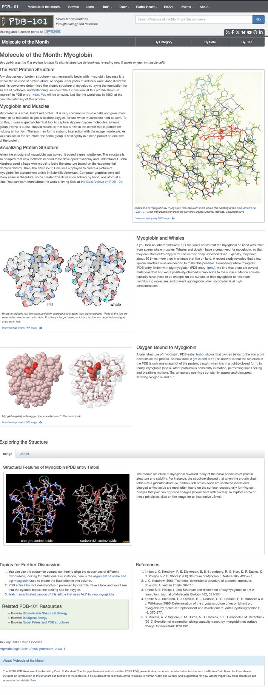
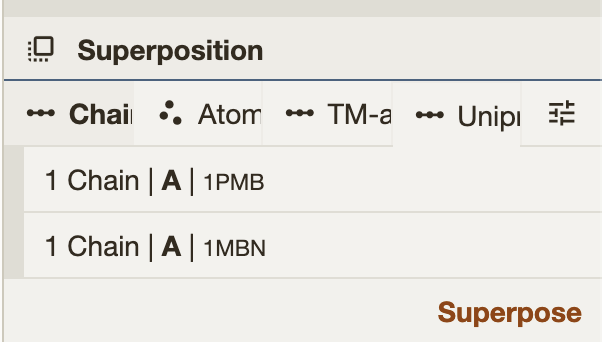
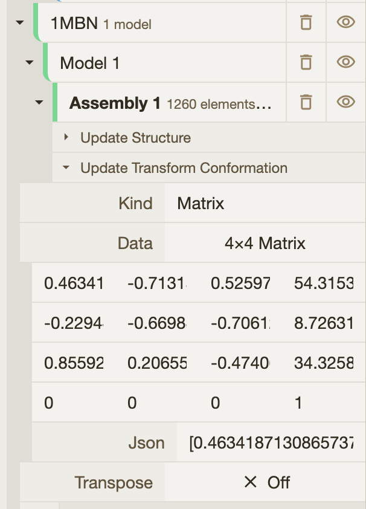
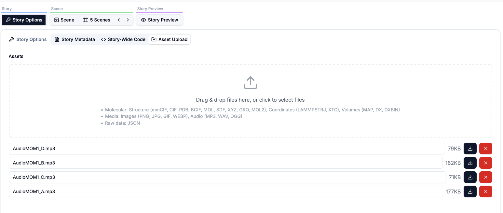

# Making of the first molecule of the month story

## Making of the Story



This story is built as a careful translation—from scientific insight to narrative experience.

We start with the original *Molecule of the Month* content by David Goodsell:  
[https://pdb101.rcsb.org/motm/1](https://pdb101.rcsb.org/motm/1)

We use ChatGPT to transform the written explanations into clear, descriptive audio narration while preserving the scientific intent and rhythm of the original text. The narration is then brought to life using Evernote's AI text-to-voice tool, generating a natural female voice-over that guides the viewer through the story:  
[https://evernote.com/ai-text-to-voice](https://evernote.com/ai-text-to-voice). Note that the audio will not play here; this example simply shows how to specify it.

Rather than reinventing the narration, we closely follow David's structure, breaking it into distinct scenes that unfold step by step. Each scene focuses on a specific idea, visual moment, or molecular insight, allowing the story to remain accessible and faithful to the source material.

To support this process, we prepare each story using a shared set of helper functions and utilities—defined once and made available across all scenes through story-wide code. This allows us to focus on storytelling and visualization while keeping the technical foundation consistent and reusable.
This code is available to all scenes in the story. Throughout the scenes, we will use [primitives](../molviewspec/primitives.qmd), [selectors](../molviewspec/selectors.qmd), and [animations](../molviewspec/animations.qmd), as well as audio playback through customization of the builder. We will also use advanced features from the [molstar customisation of the markdown syntaxe](https://molstar.org/docs/plugin/managers/markdown-extensions/).

## Story Options
In the story options we can specify metadata such as title, authors note. This is also where we provide story-wide reusable code and also where the asset are upload. In this story the only asset is the audio description for each scene. 
<details>
<summary><strong>Story-Wide Code</strong></summary>

```javascript
// All Mol* library functions are available in scope:
// - Vec3, Mat4, Mat3, Quat (from mol-math)
// - MolScriptBuilder as MS (from mol-script)
// - decodeColor, formatMolScript (from mvs)
// - builder (the MVS builder instance for each scene)


// Transformation matrices as plain arrays
// These will be converted to Mat4 by the transform function
// 1pmb->1mbn alignment
const alignMatrix = [
 0.4634187130865737, -0.7131589697034304, 0.5259728687171936, 0, -0.22944227902330105, -0.6698811108214233,
 -0.7061273127008398, 0, 0.8559202154942049, 0.2065522332899299, -0.4740643150728161, 0, -52.54880970106205,
 37.49099778180445, -6.133850309914719, 1,
];

// 1mbo->1myf alignment
const alignMboMatrix = [
 -0.8334619943964441, -0.512838061396133, -0.20576353166796402, 0, -0.20145089001561267, 0.628743285359846,
 -0.7510655776229758, 0, 0.5145474196737698, -0.5845332204089626, -0.6273453801378679, 0, 11.864847328611186,
 -1.5261713438028912, 23.638919347623467, 1,
];
```
Mol*'s Superposition tools provide a 4×4 transformation matrix for the alignment. After running the superposition, the matrix can be retrieved from the hierarchy tree. Simply click on the json input field to copy the matrix.

| | |
|---|---|
|  |  |


```javascript

// Color theme helper function - using const to ensure proper scoping
const ill_color = (color, carbonLightness) => ({
 molstar_color_theme_name: 'illustrative',
 molstar_color_theme_params: {
   style: {
     name: 'uniform',
     params: {
       value: color, // Pass color string directly
       saturation: 0,
       lightness: 0,
     },
   },
   carbonLightness: carbonLightness, // required parameter
 },
});


//Decimal color code for Grey (128, 128, 128)
// you can use tools like [https://convertingcolors.com/](https://convertingcolors.com/) to convert between different color format, RGB,HEX,Decimal etc…
const GColors2 = ill_color(8421504, 0.8);


/* Color scheme from David Goodsell illustrate software */
// David colors can be retrieve from the [illustrate web server](https://ccsb.scripps.edu/illustrate/) , of using Eyedropper tool.
const GColors3 = {
 schema: 'all_atomic',
 category_name: 'atom_site',
 field_name: 'type_symbol',
 palette: {
   kind: 'categorical',
   colors: {
     C: '#FFFFFF',
     N: '#CCE6FF',
     O: '#FFCCCC',
     S: '#FFE680',
   },
 },
};


// Audio file paths - using local assets directory
// for each scene we have prepared an audio file, preloaded in the asset upload

```


```javascript
const _Audio1 = 'AudioMOM1_A.mp3';
const _Audio2 = 'AudioMOM1_B.mp3';
const _Audio3 = 'AudioMOM1_C.mp3';
const _Audio4 = 'AudioMOM1_D.mp3';


// Helper function to get PDB URL - using const for proper scoping
const pdbUrl = (id) => {
 return `https://www.ebi.ac.uk/pdbe/entry-files/download/${id.toLowerCase()}.bcif`;
};


// Helper function to create structure from PDB ID - using const for proper scoping
const structure = (builder, id) => {
 return builder
   .download({ url: pdbUrl(id) })
   .parse({ format: 'bcif' })
   .modelStructure();
};


// Helper function to add a "Next" button - using const for proper scoping
const addNextButton = (builder, snapshotKey, position) => {
 builder
   .primitives({
     ref: 'next',
     tooltip: 'Click for next part',
     label_opacity: 0,
     label_background_color: 'grey',
     snapshot_key: snapshotKey,
   })
   .label({
     ref: 'next_label',
     position: position,
     text: 'Next Scene →',
     label_color: 'white',
     label_size: 5,
   });
};


// Helper function to create an ellipsoid (for salt bridges) - using const for proper scoping
// Accepts plain arrays or Vec3 objects as positions
const getEllipse = (builder, pos1, pos2, ref) => {
 // Convert arrays to Vec3 if needed
 const p1 = Array.isArray(pos1) ? Vec3.fromArray(Vec3(), pos1, 0) : pos1;
 const p2 = Array.isArray(pos2) ? Vec3.fromArray(Vec3(), pos2, 0) : pos2;


 const center = Vec3.add(Vec3(), p1, p2);
 Vec3.scale(center, center, 0.5);
 const major_axis = Vec3.sub(Vec3(), p2, p1);
 const z_axis = Vec3.create(0, 0, 1);
 // cross to get minor axis
 const minor_axis = Vec3.cross(Vec3(), major_axis, z_axis);
 return builder.primitives({ ref: ref, opacity: 0.33 }).ellipsoid({
   center: center,
   major_axis: major_axis,
   minor_axis: minor_axis,
   radius: [5.0, 3.0, 3.0],
   color: '#cccccc',
 });
};


// Helper function to build the 1mbn structure with common representations - using const for proper scoping
// We also keep a reference to the object's opacity for later animation.
const build1mbn = (builder) => {
 const struct = structure(builder, '1MBN');

 
 struct
   .component({ selector: 'ligand' })
   .representation({ ref: 'ligand', type: 'ball_and_stick' })
   .color({ color: 'orange' });


 // FE and O should be spacefill
 struct
   .component({ selector: { auth_seq_id: 155, label_atom_id: 'FE' } })
   .representation({ type: 'spacefill' })
   .color({ color: 'yellow' });


 struct
   .component({ selector: { auth_seq_id: 154 } })
   .representation({ type: 'spacefill' })
   .color({ color: 'blue' });


 const chA = struct.component({ selector: { label_asym_id: 'A' } });
 chA
   .representation({ type: 'surface', surface_type: 'gaussian' })
   .color({ color: '#ff0303' })
   .opacity({ ref: 'surfopa', opacity: 0.0 });


 chA
   .representation({ type: 'line' })
   .color({ custom: { molstar_color_theme_name: 'element-symbol' } })
   .opacity({ ref: 'lineopa', opacity: 0.0 });


 chA.representation({ type: 'cartoon' }).color({ custom: { molstar_color_theme_name: 'secondary-structure' } });


 return {
   struct,
   refs: {
     surfaceOpacity: 'surfopa',
     lineOpacity: 'lineopa',
   },
 };
};
// All helper functions and constants are available globally to scene files
// No exports needed - all code is combined together
```
</details>

## Scene 1 Introduction
In the *Scene Options* section, we specify the scene name and the key `first-slide`, which can be used to reference this scene and trigger it from another scene using a clickable label. 

<details>
<summary><strong>Markdown description</strong></summary>

```markdown
# Introduction

A story based on the orginal [first Molecule of the Month](https://pdb101.rcsb.org/motm/1) made by David Goodsell in January 2000.

*This story includes short audio commentaries to guide you through the structures.*  
For the best experience, please keep your sound on or use headphones.
```

</details>

<details>
<summary><strong>MolviewSpec 3D view and code</strong></summary>

```{.molviewspec}
// Hidden setup code


---
// Visible, editable code
// First, we load and prepare the visualization for hemoglobin
// using the code defined in the story-wide section.
const _1mbn = build1mbn(builder, '1MBN');

// Get the animation manager and specify that
// We will use the camera spin automation in counterclockwise 
// mode at a low speed (-0.05).
const anim = builder.animation({
  custom: {
    molstar_trackball: {
      name: 'spin',
      params: { speed: -0.05 },
    },
  },
});

// We first create a primitives container, which acts as a logical and
// reusable handle for all low-level geometric elements associated with
// this interaction. Defining the primitive up front allows us to assign
// shared properties—such as a reference ID, opacity, background color,
// and snapshot key—once, and then reuse them across any geometry we add.
//
// This primitive serves as the anchor point for interaction and animation:
// by giving it a stable reference ("start-story"), we can later retrieve
// and manipulate the label (e.g., fade it in, move it, or hide it) through
// the animation manager.
const prims = _1mbn.struct.primitives({
  ref: 'start-story',
  label_opacity: 0,
  label_background_color: 'grey',
  snapshot_key: 'intro',
});

// After the primitive is created, we add the actual label geometry. The
// label defines the visible, screen-facing text, including its content,
// spatial position in the scene, and visual size. Separating the primitive
// definition from the label geometry keeps the structure modular: the
// primitive handles identity and behavior, while the label specifies
// appearance and placement.
prims.label({
  text: 'Start story',
  position: [13.5, -4, 7.7],
  label_size: 8,
});

// Animate the label opacity to smoothly fade in the "Start story" label.
// This interpolation targets the primitive with the reference "start-story"
// and linearly updates its `label_opacity` property from fully transparent
// (0.0) to fully visible (1.0). The animation starts almost immediately
// (at 1 ms) and completes over 1 second, creating a gentle, non-intrusive
// reveal of the interactive label.
anim.interpolate({
  kind: 'scalar',
  target_ref: 'start-story',
  duration_ms: 1000,
  start_ms: 1,
  property: 'label_opacity',
  start: 0.0,
  end: 1.0,
});
```

</details>

## Scene 2 Molecule of the Month: Myoglobin
This scene adapts the first part of the Molecule of the Month entry on myoglobin into an interactive, narrated visual experience. In the Scene Options, we define the scene key reference (intro) and provide the associated description. The Markdown supplies the scientific narrative—why myoglobin mattered historically, how it stores oxygen through the heme group, and how early pioneers visualized protein structures. The MolViewSpec script then builds a guided animation: it loads the structure, configures visual styles, and progressively reveals the protein and its heme group in sync with the narration. The result is a “read + explore” scene where text, highlights, and motion work together to teach the molecule.

<details>
<summary><strong>Scene description</strong></summary>
```markdown
# Molecule of the Month: Myoglobin

Myoglobin was the first protein to have its atomic structure determined, revealing how it stores oxygen in muscle cells.

---

## The First Protein Structure

Any discussion of protein structure must necessarily begin with **myoglobin**, because it is where the science of protein structure began. After years of arduous work, *John Kendrew* and his coworkers determined the atomic structure of myoglobin, laying the foundation for an era of biological understanding.

You can take a close look at this protein structure yourself, in **PDB entry [1mbn](https://www.rcsb.org/structure/1MBN)**. You will be amazed—just like the world was in 1960—at the beautiful intricacy of this protein.

---

## Myoglobin and Muscles

[Myoglobin](!query%3Dchain%20A%26lang%3Dpymol%26action%3Dhighlight%2Cfocus) is a **small, bright red protein**. It is very common in muscle cells and gives meat much of its red color. Its job is to **store oxygen**, for use when muscles are hard at work.

To do this, it uses a special chemical tool to capture slippery oxygen molecules: a **[heme group](!query%3Dresn%20HEM%26lang%3Dpymol%26action%3Dhighlight%2Cfocus)**. Heme is a disk-shaped molecule with a hole in the center that is perfect for holding an iron ion. The iron then forms a strong interaction with the **[oxygen molecule](!query%3Dresn%20OH%26lang%3Dpymol%26action%3Dhighlight%2Cfocus)**. As you can see in the structure, the heme group is held tightly in a deep pocket on one side of the protein.

---

## Visualizing Protein Structure

When the structure of myoglobin was solved, it posed a great challenge. The structure is so complex that **new methods** needed to be developed to display and understand it.

- *John Kendrew* used a huge wire model to build the structure based on the experimental electron density.  
- Then, the artist *Irving Geis* was employed to create a picture of myoglobin for a prominent article in *Scientific American*.  
- Computer graphics were still many years in the future, so he created this illustration entirely by hand—one atom at a time.  

You can learn more about the work of Irving Geis at the **[Geis Archive on PDB-101](https://pdb101.rcsb.org/learn/GeisArchive)**.


*Illustration of myoglobin by Irving Geis. You can learn more about this painting at the Geis Archive on PDB-101.  
Used with permission from the Howard Hughes Medical Institute, Copyright 2015.*
```
The scene Markdown here include interactive links that control the 3D viewer. For example:
```markdown
[Myoglobin](!query%3Dchain%20A%26lang%3Dpymol%26action%3Dhighlight%2Cfocus)
```
This is a special link (not a normal URL). When you hover it, the viewer previews the target, and when you click it, the viewer applies the requested actions:
- `query=chain A` selects the target using a **PyMOL-style query**
- `lang=pymol` tells the system how to interpret the query string
- `action=highlight,focus` highlights the selection and moves the camera to focus on it

In practice, this lets the narration stay in Markdown while the reader can directly trigger viewer interactions.

</details>

<details>
<summary><strong>Scene MolviewSpec 3D View and Code</strong></summary>

```{.molviewspec}
// Hidden setup code


---
// Visible, editable code
// Scene 2: Molecule of the Month: Myoglobin
// Main introduction to myoglobin with animations highlighting the heme group and structure

// Turns off Mol* outline post-processing for this scene.
// That keeps the look softer/cleaner, especially for spacefill + emissive pulses.
builder.canvas({ custom: { molstar_postprocessing: { enable_outline: false } } });

// Registers a custom Markdown command (play-audio) that triggers _Audio1 when the scene loads.
// This links narration to the scene timeline.
builder.extendRootCustomState({
  molstar_on_load_markdown_commands: {
    'play-audio': _Audio1,
  },
});

// Loads and prepares the myoglobin structure using the helper.
const _1mbn = build1mbn(builder, '1MBN');

// Whale myoglobin - spacefill representation with CPK colors
// Creates a spacefill (CPK-like) view for chain A and colors 
// atoms by element via colorFromSource (C, N, O, S palette). 
// It starts fully transparent (opacity 0.0) and stores opacity 
// under ref cpkopa1 so you can animate it later.
// Note: ignoreLight: true makes the look flatter/brighter, more “illustrative”.
_1mbn.struct
  .component({ selector: { label_asym_id: 'A' } })
  .representation({ type: 'spacefill', custom: { molstar_representation_params: { ignoreLight: true } } })
  .colorFromSource({
    schema: 'all_atomic',
    category_name: 'atom_site',
    field_name: 'type_symbol',
    palette: {
      kind: 'categorical',
      colors: {
        C: '#FFFFFF',
        N: '#CCE6FF',
        O: '#FFCCCC',
        S: '#FFE680',
      },
    },
  })
  .opacity({ ref: 'cpkopa1', opacity: 0.0 });

// Heme group
// Builds a separate representation for the heme group (selected by auth_seq_id: 155)
// with a custom palette GColors2 (defined in the story-wide code),
// also starting hidden and tracked with ref cpkopa2.
_1mbn.struct
  .component({ selector: { auth_seq_id: 155 } })
  .representation({ type: 'spacefill', custom: { molstar_representation_params: { ignoreLight: true } } })
  .color({ custom: GColors2 })
  .opacity({ ref: 'cpkopa2', opacity: 0.0 });

// Adds a clickable “Next” label/button at that position, 
// linking to the next scene with key 'whale'.
addNextButton(builder, 'whale', [13.5, -4, 7.7]);

// Creates an animation timeline and enables a slow counterclockwise camera spin (negative speed). 
// This gives a subtle “alive” feel without distracting.
const anim = builder.animation({
  custom: {
    molstar_trackball: {
      name: 'spin',
      params: { speed: -0.05 },
    },
  },
});

// Fades in the line representation referenced as lineopa (defined in the story-wide code) over 2 seconds at scene start.
anim.interpolate({
  kind: 'scalar',
  target_ref: 'lineopa',
  duration_ms: 2000,
  start_ms: 0,
  property: 'opacity',
  start: 0.0,
  end: 1.0,
});

// Pulse the ligand (heme group) to draw attention
// Creates a pulsing glow effect by animating the emissive parameter on the object referenced as ligand (in the story-wide code).
// It starts at 22s, runs 10s, oscillates 6 times, alternating direction (so it pulses in/out).
anim.interpolate({
  kind: 'scalar',
  target_ref: 'ligand',
  start_ms: 22000,
  duration_ms: 10000,
  frequency: 6,
  alternate_direction: true,
  property: ['custom', 'molstar_representation_params', 'emissive'],
  end: 1.0,
});

// At 40 seconds, fades in chain A spacefill over 5 seconds.
// This is the reveal after the earlier line view + heme emphasis.
anim.interpolate({
  kind: 'scalar',
  target_ref: 'cpkopa1',
  duration_ms: 5000,
  start_ms: 40000,
  property: 'opacity',
  start: 0.0,
  end: 1.0,
});

// Also at 40 seconds, fades in the heme spacefill representation.
// Doing protein + heme together creates a nice synchronized reveal.
anim.interpolate({
  kind: 'scalar',
  target_ref: 'cpkopa2',
  duration_ms: 5000,
  start_ms: 40000,
  property: 'opacity',
  start: 0.0,
  end: 1.0,
});

// At 43 seconds, fades in the navigation label by animating label_opacity from 0→1 over 2 seconds.
// It appears after the main visual reveal and at the end of the narration, so it doesn’t distract early.
anim.interpolate({
  kind: 'scalar',
  target_ref: 'next',
  duration_ms: 2000,
  start_ms: 43000,
  property: 'label_opacity',
  start: 0.0,
  end: 1.0,
});
```

</details>

## Scene 3 Myoglobin and Whales
Scene 3 extends the myoglobin story into an evolutionary and biophysical comparison: why whales can dive so long. The markdown explains the biological motivation—marine mammals carry far more myoglobin and need molecular adaptations to avoid aggregation at high concentration. The MolViewSpec script turns that into a visual side-by-side comparison of sperm whale myoglobin (1MBN) and pig myoglobin (1PMB), then draws attention to key surface mutations by marking charged residues and pulsing a surface representation. The result is a clear “compare and understand” moment where structure, labels, and animation reinforce the narrative.

<details>
<summary><strong>Scene Description</strong></summary>
This markdown is the scene narrative:
Establishes the “whale source” fact (Kendrew’s whale myoglobin).
Explains the functional reason: high oxygen storage for deep dives.
Introduces the hypothesis/mechanism: extra positively charged residues on the surface help reduce aggregation.
Sets up the comparison explicitly via PDB links to [1mbn] and [1pmb].

```markdown
# Myoglobin and Whales

If you look at John Kendrew's PDB file, you'll notice that the myoglobin he used was taken 
from sperm whale muscles. Whales and dolphin have a great need for myoglobin, so that they can 
store extra oxygen for use in their deep undersea dives. Typically, they have about 30 
times more than in animals that live on land. A recent study revealed that a few special 
modifications are needed to make this possible.

Comparing whale myoglobin (PDB entry [1mbn](https://www.rcsb.org/structure/1mbn)) with 
pig myoglobin (PDB entry [1pmb](https://www.rcsb.org/structure/1pmb)), we find that there are 
several mutations that add extra positively-charged amino acids to the surface. Marine animals typically have these extra charges on 
the surface of their myoglobin to help repel neighboring molecules and prevent aggregation when myoglobin is at 
high concentrations.
```
</details>

<details>
<summary><strong>Scene MolviewSpec Code</strong></summary>

```{.molviewspec}
// Hidden setup code


---
// Visible, editable code
// Scene 3: Myoglobin and Whales
// Comparison of whale and pig myoglobin showing charged residues

// Loads whale myoglobin (1MBN) and applies a translation so it starts left of center.
// The transform is stored under ref whalex so you can animate its translation later.
const _1mbn = structure(builder, '1mbn').transform({ ref: 'whalex', translation: [-30, 0, 0] });

// Creates a spacefill representation for chain A and colors atoms by element using a custom palette (C/N/O/S).
// This gives a classic “CPK-like” look using the same color as in the original entry.
_1mbn
  .component({ selector: { label_asym_id: 'A' } })
  .representation({ type: 'spacefill', custom: { molstar_representation_params: { ignoreLight: true } } })
  .colorFromSource({
    schema: 'all_atomic',
    category_name: 'atom_site',
    field_name: 'type_symbol',
    palette: {
      kind: 'categorical',
      colors: {
        C: '#FFFFFF',
        N: '#CCE6FF',
        O: '#FFCCCC',
        S: '#FFE680',
      },
    },
  });

// Selects the heme group (via auth_seq_id: 155) and renders it in spacefill with a distinct palette (GColors2) so it stands out.
_1mbn
  .component({ selector: { auth_seq_id: 155 } })
  .representation({ type: 'spacefill', custom: { molstar_representation_params: { ignoreLight: true } } })
  .color({ custom: GColors2 });

// Creates a primitives container (ref prims) and adds a tethered label “whale” anchored to a position on the structure (residue 8).
// The tether makes the label feel “attached” to the molecule.
_1mbn
  .primitives({
    ref: 'prims',
    label_opacity: 1,
    label_attachment: 'top-center',
    label_show_tether: true,
    label_tether_length: 1.0,
  })
  .label({
    text: 'whale',
    position: { label_asym_id: 'A', auth_seq_id: 8 },
    label_size: 10,
  });

// Defines a group of star labels under a single ref startres, starting invisible.
// Each “★” is placed at a specific atom/residue location to mark key charged sites.
// Because they share the same primitive ref, you can fade them all in together with one animation.
// Note how you can use a selector to get a 3D position in the scene and place the label accordingly.
_1mbn
  .primitives({
    ref: 'startres',
    label_opacity: 0,
  })
  .label({
    text: '★',
    label_offset: 4,
    position: { label_asym_id: 'A', auth_seq_id: 12, atom_id: 96 },
    label_size: 5,
  })
  .label({
    text: '★',
    label_offset: 4,
    position: { label_asym_id: 'A', auth_seq_id: 140, auth_atom_id: 'NZ' },
    label_size: 5,
  })
  .label({
    text: '★',
    label_offset: 4,
    position: { label_asym_id: 'A', auth_seq_id: 87, auth_atom_id: 'NZ' },
    label_size: 5,
  });

// Charged residues surface representation
// Creates a selection containing the charged residues of interest and renders a gaussian surface around them.
const seld = _1mbn.component({
  selector: [
    { label_asym_id: 'A', auth_seq_id: 12 },
    { label_asym_id: 'A', auth_seq_id: 140 },
    { label_asym_id: 'A', auth_seq_id: 87 },
  ],
});
// This surface representation has ref 'scharged', so you can later pulse its emissive parameter to visually “glow” those sites.
seld
  .representation({
    ref: 'scharged',
    type: 'surface',
    surface_type: 'gaussian',
    custom: { molstar_representation_params: { emissive: 0.0, ignoreLight: true } },
  })
  .colorFromSource(GColors3);

// Loads pig myoglobin (1PMB) and applies a transform matrix (alignMatrix) so it’s aligned/posed relative to the whale molecule.
// The transform ref is 'pig' so you can animate its matrix later.
// the matrix come from Molstar superimpose feature, and is stored in the story-wide code.
const _1pmb = structure(builder, '1pmb').transform({ ref: 'pig', matrix: alignMatrix });

// Renders pig myoglobin in spacefill and colors it (using GColors3).
_1pmb
  .component({ selector: { label_asym_id: 'A' } })
  .representation({ type: 'spacefill', custom: { molstar_representation_params: { ignoreLight: true } } })
  .colorFromSource(GColors3);

// Then separately renders the heme group for pig with GColors2.
_1pmb
  .component({ selector: { label_asym_id: 'C', auth_seq_id: 154 } })
  .representation({ type: 'spacefill', custom: { molstar_representation_params: { ignoreLight: true } } })
  .color({ custom: GColors2 });

// Adds a tethered “pig” label with its own ref labelpig. You later fade its opacity in during the animation.
_1pmb
  .primitives({
    ref: 'labelpig',
    label_opacity: 1,
    label_attachment: 'top-center',
    label_show_tether: true,
    label_tether_length: 1.0,
  })
  .label({
    text: 'pig',
    position: { label_asym_id: 'A', auth_seq_id: 8 },
    label_size: 10,
  });

// Creates a timeline and sets a gentle counterclockwise camera spin, keeping the comparison visually dynamic.
const anim = builder.animation({
  custom: {
    molstar_trackball: {
      name: 'spin',
      params: { speed: -0.05 },
    },
  },
});

// Moves whale left over 10 seconds to make room for the pig molecule to enter.
anim.interpolate({
  kind: 'vec3',
  target_ref: 'whalex',
  duration_ms: 10000,
  start_ms: 16000,
  property: 'translation',
  start: [-30, 0, 0],
  end: [-60, 0, 0],
});

// Fades in all “★” markers at once at 20 seconds, drawing attention to charged residues.
anim.interpolate({
  kind: 'scalar',
  target_ref: 'startres',
  duration_ms: 1000,
  start_ms: 20000,
  property: 'label_opacity',
  start: 0.0,
  end: 1.0,
});

// Animates the pig transform so it slides in from the right between 18–23 seconds.
// This is a nice “compare reveal” moment.
anim.interpolate({
  kind: 'transform_matrix',
  target_ref: 'pig',
  duration_ms: 5000,
  start_ms: 18000,
  property: 'matrix',
  translation_start: [-82.54880970106205, 37.49099778180445, -6.133850309914719],
  translation_end: [-52.54880970106205, 37.49099778180445, -6.133850309914719],
});

// Reveals the “pig” label as it appears (so the viewer immediately knows which is which).
anim.interpolate({
  kind: 'scalar',
  target_ref: 'labelpig',
  duration_ms: 2000,
  start_ms: 18000,
  property: 'label_opacity',
  start: 0.0,
  end: 1.0,
});

//Adds navigation to the next scene (oxygen) and fades the button in near the end of the scene.
addNextButton(builder, 'oxygen', [-18.9, -4, 7.3]);

// Fade in next button at the end of the scene
anim.interpolate({
  kind: 'scalar',
  target_ref: 'next',
  duration_ms: 2000,
  start_ms: 38000,
  property: 'label_opacity',
  start: 0.0,
  end: 1.0,
});

// Play audio when this scene loads
// Maps the play-audio command to _Audio2 for this scene, so narration can be triggered on load or via markdown commands.
builder.extendRootCustomState({
  molstar_on_load_markdown_commands: {
    'play-audio': _Audio2,
  },
});

// Adds a pulsing “glow” to the charged-residue surface representation (scharged) by animating its emissive parameter. This reinforces the narrative: “these mutations matter.”
anim.interpolate({
  kind: 'scalar',
  target_ref: 'scharged',
  start_ms: 20000,
  duration_ms: 6000,
  frequency: 6,
  alternate_direction: true,
  property: ['custom', 'molstar_representation_params', 'emissive'],
  start: 0.0,
  end: 1.0,
});
```
</details>

## Scene 4 Oxygen Bound
Scene 4 (key: oxygen) focuses on the moment oxygen binds to myoglobin—and, more importantly, on the dynamic nature of proteins that makes binding possible. The markdown explains that a crystal structure such as 1MBO is only a single snapshot, while real proteins continuously “breathe” through small conformational fluctuations, creating transient pathways for oxygen to enter and leave. The MolViewSpec script reinforces this idea visually: it shows bound oxygen, animates an NMR ensemble (1MYF) to convey motion, and illustrates oxygen traveling along a path into the binding pocket. The result is a clear, intuitive explanation of how molecular dynamics enables function.

<details>
<summary><strong>Scene Description</strong></summary>
This markdown provides the scientific narrative for the scene:
Introduces oxygen binding observed in PDB 1MBO
Answers the “how does oxygen get in/out?” question by emphasizing protein dynamics
Uses PDB 1MYF as the visual illustration of breathing/flexing motions
Frames the viewer’s understanding: the PDB is a snapshot; biology is motion

```markdown
# Oxygen Bound to Myoglobin

A later structure of myoglobin, PDB entry [1mbo](https://www.rcsb.org/structure/1mbo), 
shows that oxygen binds to the iron atom deep inside the protein. 
So how does it get in and out? The 
answer is that the structure in the PDB is only one snapshot of the 
protein, caught when it is in a tightly-closed form. In reality, 
myoglobin (and all other proteins) is constantly in motion, performing 
small flexing and breathing motions (illustrated here by PDB entry [1myf](https://www.rcsb.org/structure/1myf)). So, temporary openings constantly 
appear and disappear, allowing oxygen in and out.
```
</details>

<details>
<summary><strong>Scene MolViewSpec 3D View and Code</strong></summary>

```{.molviewspec}
// Hidden setup code


---
// Visible, editable code
// Scene 4: Oxygen Bound
// Shows oxygen binding to myoglobin and protein breathing motions

// Loads 1MBO (myoglobin with oxygen bound) and applies a precomputed transform matrix alignMboMatrix so it aligns with the NMR ensemble view.
const _1mbo = structure(builder, '1mbo').transform({ matrix: alignMboMatrix });

// Downloads and prepares 1MYF, which contains multiple conformations (an ensemble). You keep a reference 1myf so you can animate the model index later.
const _1myf = builder
  .download({ url: pdbUrl('1myf') })
  .parse({ format: 'bcif' })
  .modelStructure({ ref: '1myf' });

// Defines a consistent palette: soft red for the protein, stronger red for the heme, cyan for oxygen.
const red1 = '#d3a4a6';
const red2 = '#d75354';
const blue1 = '#02d1d1';

// Renders the protein in spacefill (chain A) and stores its opacity in ref spo.
// The plan is to start with a solid “blob” view, then fade it down to reveal the backbone and emphasize motion.
_1myf
  .component({ selector: { label_asym_id: 'A' } })
  .transform({ translation: [0, 0, 0] })
  .representation({ type: 'spacefill' })
  .color({ color: red1 })
  .opacity({ ref: 'spo', opacity: 1.0 });

// Shows the heme group in spacefill and colors it with an “illustration-style” helper ill_color(...).
_1mbo
  .component({ selector: { label_asym_id: 'C', auth_seq_id: 155 } })
  .representation({ type: 'spacefill' })
  .color({ custom: ill_color(14134100, 1.0)});

// Adds a backbone representation so that when spacefill fades out, the viewer still sees the protein structure clearly—especially as it changes across the ensemble models.
_1myf
  .component({ selector: { label_asym_id: 'A' } })
  .representation({ type: 'backbone' })
  .color({ color: red1 });

// Creates a static oxygen representation with ref oxy. 
// You animate its emissive later to “pulse” it and draw attention.
_1mbo
  .component({ selector: { label_asym_id: 'D', auth_seq_id: 555 } })
  .representation({
    ref: 'oxy',
    type: 'spacefill',
    custom: {
      molstar_representation_params: {
        emissive: 0.0,
      },
    },
  })
  .color({ color: blue1 });

// Creates a second oxygen representation intended for motion: it has its own transform ref oxyy (so you can translate it in/out) and starts hidden (oxop opacity = 0).
// This is a nice pattern: one oxygen for pulsing highlight, another for motion demonstration.
_1mbo
  .component({ selector: { label_asym_id: 'D', auth_seq_id: 555 } })
  .transform({ ref: 'oxyy', translation: [0, 0, 0] })
  .representation({ type: 'spacefill' })
  .color({ color: blue1 })
  .opacity({ ref: 'oxop', opacity: 0.0 });

//Get the animation manager and adds subtle camera spin to keep the view lively while the text/audio explains dynamics.
const anim = builder.animation({
  custom: {
    molstar_trackball: {
      name: 'spin',
      params: { speed: -0.05 },
    },
  },
});

// Immediately fades the spacefill from opaque to nearly transparent, so the backbone becomes the main readable structure while still retaining faint volumetric context.
anim.interpolate({
  kind: 'scalar',
  target_ref: 'spo',
  duration_ms: 5000,
  start_ms: 0,
  property: 'opacity',
  start: 1.0,
  end: 0.05,
});

// Animates the model_index of the ensemble between models 0–11 (discrete stepping) to show breathing/flexing motions. With alternate_direction: true, it cycles back and forth, which reads as “breathing”.
anim.interpolate({
  kind: 'scalar',
  target_ref: '1myf',
  start_ms: 11000,
  duration_ms: 10000,
  frequency: 4,
  alternate_direction: true,
  property: 'model_index',
  discrete: true,
  start: 0,
  end: 11,
});

// Makes the static oxygen glow/pulse via emissive to highlight the binding event early in the scene.
anim.interpolate({
  kind: 'scalar',
  target_ref: 'oxy',
  start_ms: 3000,
  duration_ms: 10000,
  frequency: 7,
  alternate_direction: true,
  property: ['custom', 'molstar_representation_params', 'emissive'],
  end: 1.0,
});

// Moves the animated oxygen from outside the protein toward the binding site. The noise_magnitude adds slight jitter so it looks more like diffusion.
anim.interpolate({
  kind: 'vec3',
  target_ref: 'oxyy',
  duration_ms: 5000,
  start_ms: 16000,
  property: 'translation',
  frequency: 4,
  alternate_direction: false,
  start: [5, -5, -20],
  end: [0, 0, 0],
  noise_magnitude: 1,
});

// Reveals the moving oxygen shortly before the motion begins, so the “in/out” motion is visible.
anim.interpolate({
  kind: 'scalar',
  target_ref: 'oxop',
  duration_ms: 1000,
  start_ms: 15000,
  property: 'opacity',
  start: 0.0,
  end: 1.0,
});

//Adds navigation to the next scene (end) and fades the button in so it appears after the key teaching moment.
addNextButton(builder, 'end', [0, -25, 0.0]);

// Fade in next button
anim.interpolate({
  kind: 'scalar',
  target_ref: 'next',
  duration_ms: 2000,
  start_ms: 18000,
  property: 'label_opacity',
  start: 0.0,
  end: 1.0,
});

// Play audio when this scene loads
// Maps the play-audio command to _Audio3, connecting narration to this scene.
builder.extendRootCustomState({
  molstar_on_load_markdown_commands: {
    'play-audio': _Audio3,
  },
});
```
</details>

## Scene 5 Conclusion

Scene 5 (key: end) wraps up the story by connecting myoglobin’s structure to broader principles of protein stability and function. The markdown summarizes classic ideas—hydrophobic residues packed inside, charged residues exposed on the surface, and occasional salt bridges that stabilize local structure—then invites the reader to freely explore. The MolViewSpec script turns those principles into a guided visual: it highlights hydrophobic and charged amino acids with distinct colors, overlays salt-bridge cues using distance measurements and ellipse annotations, and paces the reveal with simple animations. The scene ends with a navigation label that loops back to the start, making the story replayable.

<details>
<summary><strong>Scene 5 Conclusion</strong></summary>
This Markdown provides the concluding narrative and references for the story.
It summarizes key structural principles revealed by the atomic structure of myoglobin, including the burial of hydrophobic (carbon-rich) residues in the protein core, the exposure of charged residues on the surface, and the formation of stabilizing salt bridges between oppositely charged amino acids. The text then encourages readers to explore these principles directly in the interactive view.
The final sections offer directions for further exploration—such as comparing myoglobin sequences across species or examining cyanide-bound myoglobin—and include a set of primary references that document the historical and scientific context of the structures used in this story.

```markdown
# Molecule of the Month: Myoglobin

The atomic structure of myoglobin revealed many of the basic principles 
of protein structure and stability. For instance, the structure showed 
that when the protein chain folds into a globular structure, 
carbon-rich amino acids are sheltered 
inside and charged amino acids positively 
and negatively are most often found on the surface, 
occasionally forming salt bridges 
that pair two opposite charges (shown here with circles). 

To explore some of these principles, explore freely in the interactive view.

## Topics for Further Discussion

You can use the sequence comparison tool to align the sequences of different 
myoglobins, looking for mutations. For instance, [here is the alignment of whale and pig myoglobin](https://www.rcsb.org/alignment?request-body=eJyljrsOwjAMRf%2FFcxgqxNKN7kXsqKpC4pZIeZTEVamq%2FDtOGRAzm%2BPje3I3eM4YV6g3CBOZ4FMZI9IcfZ%2BQoVfYa0kS6kHahFmACp7wReXQBY1QwyRNXExCEOCQHkEX5qUrjNxBWjN64GSiOCtWI%2F9y2wA9xbU3fA1V21w4ndCiKjWKQKbVfeiZ0R3HUmhfVIKz%2Bvs8HXMWv75r2%2Fzn61gJg7F71y6%2FARZEZL8%3D&response-body=eJzlU11vmzAU%2FS88Q2RsjKFv7iCA7GRJQFRVVUU0uClSQjo%2BtkVV%2FvuuyUdTadMeurcJIXF97j33HN%2FLm1HVzzvj5s3o%2B6o0bgzlUaZoyaynwvUshznPll8UpVVgRUr1hAkrmWEabVd0fQv5X75OZjLMQuNgGlvVFZqq2FTreqvqbrndlQqSXouq%2BVG1CgqvMNW97HTLbmsNp5qiUW2%2F6YD44Q16NP2q6%2BFoCKGm2S8HkfbkdqpFqI1addWuHpq2%2B%2B0R5QA9qfWyVd%2BGA9uE2vI9pORwMD%2FyzSa3n%2BN7NN%2FlLi8eB92NWgOl9vDwF1YdVnWpfho3yDQ2ql53L0f%2BR%2FMTtaCta4q6fd4126I7a7FNdHp%2B%2BwUd0chxCXY9xjA2LTRiNkWMONT2TDSimDi%2Bz1yHQDaAmGCbeTbxXR25rodsG%2FvHiCGGEHE9D2vukUcpdgnBlEGAEfU9RrFPdKbDqOMT2x8yLYpH1MWOQxzP9U3CRi5lBCGKoKlFR77j2Rg5iNkgVw%2Bg326LZq%2BH165257X5Xmx62EFo68I97F%2F1PsK99apeKasqYUpVtzf0QlwyXeeSuZikwUfQ9y5gNrGGRoYefw1jr5fQtSp7tdQb3w73rxH9G2xUeUa1MI3Aq2XDEHUpzOxUoKPV7rtqirXSqQjmgdDjcctO0v%2B4ZJ%2FYsQs5lOYyDaPwbi5zGed3XOQhD3IexdE8SGSykGORxrMwk6EYB4uxiKXIQh5OBE%2FDQAoRR3mWy4zLiCcQiiiOAZZiJvk8jXkmYpHMEnEvw3GShjxJYuiTLuJZFIwjHvB5xCdTwWUoxwsRJJyLexHK6H4eDdP453YjmQYnu9P8LrqyG%2BZHu9HFrhjsgs9ru9OT3ejabvbBbn5ld57LeSo%2B2E1PdqfB5Gx3rO3%2BH5t9%2BAU7Kf5z&encoded=true) used to create the illustration in this column.

PDB entry [2jho](https://www.rcsb.org/structure/2jho) includes myoglobin poisoned by cyanide. Take a look and you'll see that the cyanide blocks the binding site for oxygen.

## References

- 1mbn: J. C. Kendrew, R. E. Dickerson, B. E. Strandberg, R. G. Hart, D. R. Davies, D. C. Phillips & V. C. Shore (1960) Structure of Myoglobin. Nature 185, 422-427.
- J. C. Kendrew (1961) The three-dimensional structure of a protein molecule. Scientific American 205(6), 96-110.
- 1mbo: S. E. Phillips (1980) Structure and refinement of oxymyoglobin at 1.6 A resolution. Journal of Molecular Biology 142, 531-554.
- 1pmb: S. J. Smerdon, T. J. Oldfield, E. J. Dodson, G. G. Dodson, R. E. Hubbard & A. J. Wilkinson (1990) Determination of the crystal structure of recombinant pig myoglobin by molecular replacement and its refinement. Acta Crystallographica B, 46, 370-377.
- 1myf: Osapay K, Theriault Y, Wright PE, Case DA. Solution structure of carbonmonoxy myoglobin determined from nuclear magnetic resonance distance and chemical shift constraints. J Mol Biol. 1994;244(2):183-197. doi:10.1006/jmbi.1994.1718
- S. Mirceta, A. V. Signore, J. M. Burns, A. R. Cossins, K. L. Campbell & M. Berenbrink (2013) Evolution of mammalian diving capacity traced by myoglobin net surface charge. Science 340, 1234192.
```
</details>

<details>
<summary><strong>Molviewspec 3D view and code</strong></summary>

```{.molviewspec}
// Hidden setup code


---
// Visible, editable code
// Scene 5: Conclusion
// Shows different amino acid types and salt bridges in myoglobin

//Loads whale myoglobin (1MBN) as the base structure used for the final teaching summary.
const _1mbn = structure(builder, '1mbn');

// Builds selectors for three chemically meaningful categories.
// These selector arrays are later used to create separate components and representations for each group.
// hydrophobic (carbon-rich) residues
const carb = ['ALA', 'VAL', 'LEU', 'ILE', 'MET', 'PHE', 'TRP', 'PRO'].map((amk) => ({ label_comp_id: amk }));
// positively charged residues
const chargedp = ['LYS', 'ARG', 'HIS'].map((amk) => ({ label_comp_id: amk }));
// negatively charged residues
const chargedn = ['ASP', 'GLU'].map((amk) => ({ label_comp_id: amk }));

// Creates two distance measurement annotations corresponding to two proposed salt bridges. They start with label_opacity: 0.0 so you can reveal them later in sync with the narration.
// ASP44-OD1-356 to LYS47-NZ-388
// LYS77-NZ-613 to GLU18-OE1-149
_1mbn
  .primitives({ ref: 'dist', label_opacity: 0.0 })
  .distance({
    start: { label_asym_id: 'A', auth_seq_id: 44, atom_id: 356 },
    end: { label_asym_id: 'A', auth_seq_id: 47, atom_id: 388 },
    radius: 0.1,
    dash_length: 0.1,
    label_size: 2,
  })
  .distance({
    start: { label_asym_id: 'A', auth_seq_id: 77, atom_id: 613 },
    end: { label_asym_id: 'A', auth_seq_id: 18, atom_id: 149 },
    radius: 0.1,
    dash_length: 0.1,
    label_size: 2,
  });

// Adds two ellipse graphics (refs salt1 and salt2) to visually “circle” the regions around each salt bridge, matching the wording in the markdown (“shown here with circles”).
// First salt bridge
// ASP44 OD1: 22.300 33.300 -6.200
// LYS47 NZ: 23.200 32.000 -8.400
const r44 = [22.3, 33.3, -6.2];
const r47 = [23.2, 32.0, -8.4];
getEllipse(builder, r44, r47, 'salt1');

// Second salt bridge
// GLU18 OE1: 16.600 22.500 20.500
// LYS77 NZ: 14.100 23.600 22.200
const r18 = [16.6, 22.5, 20.5];
const r77 = [14.1, 23.6, 22.2];
getEllipse(builder, r18, r77, 'salt2');

// Creates separate ball-and-stick representations for each residue category, with distinct colors.
// Each group stores an opacity reference (carb, chargedp, chargedn) so you can animate them independently.
// hydrophobic residues carbon-rich amino acids representation, light violet
const a = _1mbn.component({ selector: carb });
a.representation({ type: 'ball_and_stick' }).color({ color: '#bec0f2' }).opacity({ ref: 'carb', opacity: 1.0 });

// Positively charged amino acids representation, blue
const b = _1mbn.component({ selector: chargedp });
b.representation({ type: 'ball_and_stick' })
  .color({ custom: ill_color('blue', 3.0) })
  .opacity({ ref: 'chargedp', opacity: 1.0 });

// Negatively charged amino acids representation, red
const c = _1mbn.component({ selector: chargedn });
c.representation({ type: 'ball_and_stick' })
  .color({ custom: ill_color('red', 3.0) })
  .opacity({ ref: 'chargedn', opacity: 1.0 });

// Renders a neutral backbone so the residue highlights sit in structural context.
_1mbn
  .component({ selector: { label_asym_id: 'A' } })
  .representation({ type: 'backbone' })
  .color({ color: '#919191' });

// Displays the heme (and any ligand selection) in orange, giving the viewer a familiar reference point even in the conclusion scene.
_1mbn
  .component({ selector: 'ligand' })
  .representation({
    ref: 'ligand',
    type: 'ball_and_stick',
    custom: {
      molstar_representation_params: {
        emissive: 0.0,
      },
    },
  })
  .color({ color: 'orange' });

// Creates the animation timeline.
const anim = builder.animation({});

// Pulse carbon-rich amino acids
// Uses a brief pulse to draw attention to the buried hydrophobic residues concept.
anim.interpolate({
  kind: 'scalar',
  target_ref: 'carb',
  duration_ms: 2000,
  start_ms: 8000,
  frequency: 2,
  alternate_direction: true,
  property: 'opacity',
  start: 0.0,
  end: 1.0,
});

// Brings positive and negative surface residues in together, matching the “charged residues are on the surface” message.
// positively charged amino acids
anim.interpolate({
  kind: 'scalar',
  target_ref: 'chargedp',
  duration_ms: 1000,
  start_ms: 10000,
  property: 'opacity',
  start: 0.0,
  end: 1.0,
});

// negatively charged amino acids
anim.interpolate({
  kind: 'scalar',
  target_ref: 'chargedn',
  duration_ms: 1000,
  start_ms: 10000,
  property: 'opacity',
  start: 0.0,
  end: 1.0,
});

// Shows the circles/ellipses lightly (opacity 0.3) and then brings in the measured distances, reinforcing “salt bridges pair opposite charges.”
// First salt bridge ellipses
anim.interpolate({
  kind: 'scalar',
  target_ref: 'salt1',
  duration_ms: 1000,
  start_ms: 11000,
  property: 'opacity',
  start: 0.0,
  end: 0.3,
});
// Second salt bridge ellipses
anim.interpolate({
  kind: 'scalar',
  target_ref: 'salt2',
  duration_ms: 1000,
  start_ms: 11000,
  property: 'opacity',
  start: 0.0,
  end: 0.3,
});

// Distance measurements
anim.interpolate({
  kind: 'scalar',
  target_ref: 'dist',
  duration_ms: 1000,
  start_ms: 11000,
  property: 'label_opacity',
  start: 0.0,
  end: 1.0,
});

// Adds the “Next” button that actually loops back to intro, turning the ending into a “replay / restart” affordance. The fade-in timing ensures it appears after the teaching sequence.
addNextButton(builder, 'intro', [13.5, -10.0, 7.7]);

anim.interpolate({
  kind: 'scalar',
  target_ref: 'next',
  duration_ms: 2000,
  start_ms: 20000,
  property: 'label_opacity',
  start: 0.0,
  end: 1.0,
});

// Maps play-audio to the conclusion narration _Audio4.
// Play audio when this scene loads
builder.extendRootCustomState({
  molstar_on_load_markdown_commands: {
    'play-audio': _Audio4,
  },
});
```
</details>


## Conclusion

Myoglobin was the first protein whose atomic structure was solved, and it remains a landmark example of how structure explains biological function. Across these scenes, we have seen how a static PDB structure captures only a single moment, while real proteins are dynamic objects whose motion enables processes such as oxygen binding and release.

By combining scientific narration with interactive visualization, this story invites readers to move beyond passive observation and actively explore molecular structure. Highlighting residues, comparing species, and animating motion help translate abstract structural principles into intuitive, visual understanding.

This approach—linking trusted scientific content with interactive, scene-based exploration—can be extended to many other molecules, offering a powerful way to communicate molecular biology to both specialists and broader audiences.