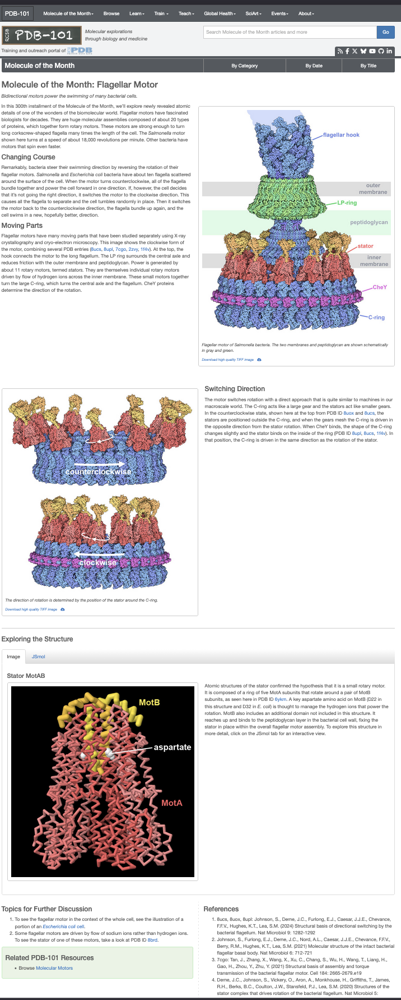

# Making of the 300th molecule of the month story - Flagella Motor



This page documents the construction of the the [300th *Molecule of the Month*](https://pdb101.rcsb.org/motm/300) content by David Goodsell which explores the bacterial flagellar motor—one of the most sophisticated molecular machines known.

Unlike small, single-protein examples, this story brings together multiple experimental structures, spanning X-ray crystallography and cryo-electron microscopy, into a single coherent, interactive narrative. The goal is not only to show the final assembled motor, but to explain how its parts work together and how biological function emerges from structure and motion.

## Overview
The bacterial flagellar motor is a large, multi-protein rotary engine that powers bacterial swimming. It is composed of dozens of copies of many different proteins, organized into rings, rods, stators, and regulatory complexes that span the cell envelope.

The MOM300 story breaks this complexity into a sequence of scenes, each focusing on a specific structural or functional aspect of the motor. Instead of presenting all components at once, the story uses progressive disclosure—adding detail, motion, and interaction as the narrative unfolds.

Each scene combines:
- a Markdown-based scientific narrative based on the pdb entry page,
- interactive highlights and camera focus driven directly from the text,
- MolViewSpec-based visualization and animation.
- Audio description made with chatGPT from the scientific narrative and said using [Evernote's AI text-to-voice tool](https://evernote.com/ai-text-to-voice). Note that the audio will not play here; this example simply shows how to specify it.

To support this process, we prepare each story using a shared set of helper functions and utilities—defined once and made available across all scenes through story-wide code. This allows us to focus on storytelling and visualization while keeping the technical foundation consistent and reusable.
This code is available to all scenes in the story. Throughout the scenes, we will use [primitives](../molviewspec/primitives.qmd), [selectors](../molviewspec/selectors.qmd), and [animations](../molviewspec/animations.qmd), as well as audio playback through customization of the builder. We will also use advanced features from the [molstar customisation of the markdown syntaxe](https://molstar.org/docs/plugin/managers/markdown-extensions/).

## Story preparation : Building the asset
The flagellar motor is composed of multiple structural components that must be assembled to represent both rotational states: the **clockwise (CW)** and **counterclockwise (CCW)** conformations. We begin with the hook structure [`7CGO`](https://www.rcsb.org/structure/7CGO), which serves as the structural reference. This model includes the hook, the L/P ring, and the M ring, each built from repeated instances of a unique chain corresponding to a specific functional entity. As a first step, we identify these chains and store the chain-to-entity mapping in story-wide code (see below).

Next, we incorporate the C-ring in both rotational states using the CW and CCW structures [`8UPL`](https://www.rcsb.org/structure/8UPL) and [`8UOX`](https://www.rcsb.org/structure/8UOX). By recentering these structures, they can be directly aligned to the hook reference frame defined by 7CGO. 

We then assemble the MotAB stator using two complementary structures, [`8UCS`](https://www.rcsb.org/structure/8UCS) and [`2ZVY`](https://www.rcsb.org/structure/2ZVY). Using Mol* superposition tools, the MotAB complexes are aligned relative to the C-ring. To generate the full stator ring, consisting of 11 copies, we apply the [ChimeraX symmetry command](https://www.cgl.ucsf.edu/chimerax/docs/user/commands/sym.html). This procedure is performed independently for both the CW and CCW configurations.

Finally, the CheY response regulator [`1F4V`](https://www.rcsb.org/structure/1F4V) is added and aligned in the same reference frame, completing the assembly for both rotational states.

All customized structure are provided directly in the story template.

## Story Options
In the story options we can specify metadata such as title, authors note. This is also where we provide story-wide reusable code and also where the asset are upload. 

<details>
<summary><strong>Story-Wide Code</strong></summary>

```javascript
// ============================================================================
// Story-wide (common) code shared by all scenes
// ============================================================================
//
// This code is executed once for the entire story and reused by every scene.
// It defines:
//
//  • Global Mol* canvas and postprocessing configuration
//  • Representation presets (spacefill vs surface, LOD settings)
//  • Color theme helpers (chain-based illustrative coloring)
//  • Animation helpers (emissive pulsing)
//  • PDB/BCIF download helpers
//  • Chain/entity tables for large flagellar motor assemblies
//  • Selector builders for grouping and alternating chains
//  • Symmetry helpers for Cn rotational duplication
//
// Mol* helper classes assumed to be available:
//   Vec3, Mat3, Mat4, Quat, Euler, decodeColor,
//   MolScriptBuilder, formatMolScript
//
// PDB assets are downloaded dynamically from PDBe in BCIF format.
// ============================================================================


// ----------------------------------------------------------------------------
// Canvas & global rendering setup
// ----------------------------------------------------------------------------
builder.canvas({
  background_color: 'white',
  custom: {
    molstar_postprocessing: {
      enable_bloom: true,

      enable_ssao: true,
      ssao_params: {
        samples: 32,
        multiScale: {
          name: 'on',
          params: {
            levels: [
              { radius: 2, bias: 1.0 },
              { radius: 5, bias: 1.0 },
              { radius: 8, bias: 1.0 },
              { radius: 11, bias: 1.0 },
            ],
            nearThreshold: 10,
            farThreshold: 1500,
          },
        },
        radius: 5,
        bias: 1,
        blurKernelSize: 11,
        blurDepthBias: 0.5,
        resolutionScale: 1,
        color: '0x000000',
        transparentThreshold: 0.4,
      },

      enable_fog: false,
      fog_params: { intensity: 90.0 },

      enable_dof: false,
      dof_params: {
        blurSize: 9,
        blurSpread: 1,
        inFocus: 0,
        PPM: 100.0,
        center: 'camera-target',
        mode: 'sphere',
      },

      enable_shadow: false,
      shadow_params: {
        maxDistance: 256,
        steps: 12,
        tolerance: 0.0,
      },

      enable_outline: true,
    },
  },
});


// ----------------------------------------------------------------------------
// Representation mode switch
// ----------------------------------------------------------------------------
// true  → spacefill / illustrative look
// false → surface / continuous shell look
const visual_option = true;


// ----------------------------------------------------------------------------
// Level-of-detail (LOD) configuration for performance
// ----------------------------------------------------------------------------
const lod = [
  { minDistance: 1, maxDistance: 500, overlap: 0, stride: 1, scaleBias: 1 },
  { minDistance: 500, maxDistance: 1000, overlap: 0, stride: 5, scaleBias: 3 },
  { minDistance: 1000, maxDistance: 6000, overlap: 0, stride: 30, scaleBias: 2.7 },
  { minDistance: 6000, maxDistance: 10000000, overlap: 0, stride: 200, scaleBias: 2.5 },
];

const granularity = {
  molstar_representation_params: {
    lodLevels: lod,
    instanceGranularity: true,
    emissive: 0.0,
    ignoreLight: true,
    clipPrimitive: true,
  },
};

const spacefillrep = { type: 'spacefill', custom: granularity };
const surfacerep  = { type: 'surface', surface_type: 'gaussian', custom: granularity };

const prot_rep = visual_option ? spacefillrep : surfacerep;


// ----------------------------------------------------------------------------
// Chain color themes
// ----------------------------------------------------------------------------
function createChainColorIllustrateTheme(chainColors, carbonLightness = 0.8) {
  return {
    custom: {
      molstar_color_theme_name: 'illustrative',
      molstar_color_theme_params: {
        style: {
          name: 'chain-id',
          params: {
            asymId: 'label',
            palette: {
              name: 'colors',
              params: {
                list: {
                  kind: 'set',
                  colors: chainColors,
                },
              },
            },
          },
        },
        carbonLightness,
      },
    },
  };
}

function createChainColorStandardTheme(chainColors, carbonLightness = 0.8) {
  return {
    custom: {
      molstar_color_theme_name: 'chain-id',
      molstar_color_theme_params: {
        style: {
          name: 'chain-id',
          params: {
            asymId: 'auth',
            palette: {
              name: 'colors',
              params: {
                list: {
                  kind: 'set',
                  colors: chainColors,
                },
              },
            },
          },
        },
        carbonLightness,
      },
    },
  };
}

function decimalToHexColor(decimal) {
  return '#' + ('000000' + decimal.toString(16)).slice(-6);
}

function createChainColorDefaultTheme(chainColors) {
  return { color: decimalToHexColor(chainColors[0]) };
}

function createChainColorTheme(chainColors, carbonLightness = 0.8) {
  return visual_option
    ? createChainColorIllustrateTheme(chainColors, carbonLightness)
    : createChainColorDefaultTheme(chainColors);
}


// ----------------------------------------------------------------------------
// Animation helper: emissive pulsing
// ----------------------------------------------------------------------------
const makeEmissivePulse = (proteinRef, start_ms, dur, freq) => ({
  kind: 'scalar',
  target_ref: proteinRef,
  start_ms,
  duration_ms: dur,
  frequency: freq,
  alternate_direction: true,
  property: ['custom', 'molstar_representation_params', 'emissive'],
  start: 0.0,
  end: 0.65,
});


// ----------------------------------------------------------------------------
// Reference centers for major PDB entries
// ----------------------------------------------------------------------------
const pdbCenters = {
  '8UOX': { center: [425.9787, 425.9856, 434.4256] },
  '8UCS': { center: [154.3888, 153.3654, 157.5505] },
  '8UPL': { center: [425.9848, 425.9806, 429.4423] },
  '7CGO': { center: Vec3.create(333.6229, 335.3563, 303.2562) },
  '2ZVY': { center: [1.2462, -17.1129, -11.6849] },
  '1F4V': { center: [16.0163, 54.3369, 91.6346] },
};


// ----------------------------------------------------------------------------
// Chain/entity tables — 7CGO (basal body + hook)
// ----------------------------------------------------------------------------
const chains7CGO = {
  "1": { name: "Flagellar basal-body rod protein FlgG", uniprot: "P0A1J3",
    chains: ["A","B","C","D","E","F","G","H","I","J","K","L","M","N","O","P","Q","R","S","T","U","VA","WA","XA"] },

  "2": { name: "Flagellar basal-body rod protein FlgF", uniprot: "P16323",
    chains: ["V","W","X","Y","Z"] },

  "3": { name: "Flagellar MS ring L2", uniprot: "—",
    chains: ["AA","BA","CA","DA","EA"] },

  "4": { name: "Flagellar MS ring L1", uniprot: "P15928",
    chains: ["FA","GA","HA","IA","RA"] },

  "5": { name: "Flagellar basal-body rod protein FlgC", uniprot: "P0A1I7",
    chains: ["JA","KA","LA","MA","QA","SA"] },

  "6": { name: "Flagellar basal-body rod protein FlgB", uniprot: "P16437",
    chains: ["NA","OA","PA","TA","UA"] },

  "7": { name: "Flagellar hook-basal body complex protein FliE", uniprot: "P26462",
    chains: ["AB","BB","CB","DB","YA","ZA"] },

  "8": { name: "Flagellar hook protein FlgE", uniprot: "P0A1J1",
    chains: [
      "AH","BH","CH","DH","EB","EH","FB","FH","GB","GH","HB","HH","IB","IH",
      "JB","JH","KB","KH","LB","MB","NB","OB","PG","QG","RG","SG","TG","UG",
      "VG","WG","XG","YG","ZG"
    ] },

  "9":  { name: "Flagellar biosynthetic protein FliR", uniprot: "P54702", chains: ["PB"] },
  "10": { name: "Flagellar biosynthetic protein FliQ", uniprot: "P0A1L5", chains: ["QB","RB","SB","TB"] },
  "11": { name: "Flagellar biosynthetic protein FliP", uniprot: "P54700", chains: ["UB","VB","WB","XB","YB"] },

  "12": { name: "Flagellar M-ring protein", uniprot: "P15928",
    chains: [
      "AC","AE","BC","BE","CC","CE","DC","DE","EC","EE","FC","FE","GC","GE",
      "HC","HD","HE","IC","ID","IE","JC","JD","JE","KC","KD","KE","LC","LD",
      "LE","MC","MD","ME","NC","ND","NE","OC","OD","OE","PC","PD","QC","QD",
      "RC","RD","SC","SD","TC","TD","UC","UD","VC","VD","WD","XD","YD","ZB","ZD"
    ] },

  "13": { name: "FlgB-Dc loop", uniprot: "—", chains: ["DD","ED","FD","GD","WC"] },
  "14": { name: "FliE helix 1", uniprot: "—", chains: ["AD","BD","CD","XC","YC","ZC"] },

  "15": { name: "Flagellar L-ring protein", uniprot: "P0A1N8",
    chains: [
      "AF","BF","CF","DF","EF","FF","GF","HF","IF","JF","KF","LF","MF","NF","OF",
      "PE","QE","RE","SE","TE","UE","VE","WE","XE","YE","ZE"
    ] },

  "16": { name: "Flagellar P-ring protein", uniprot: "P15930",
    chains: [
      "AG","BG","CG","DG","EG","FG","GG","HG","IG","JG","KG","LG","MG","NG","OG",
      "PF","QF","RF","SF","TF","UF","VF","WF","XF","YF","ZF"
    ] },
};


// ----------------------------------------------------------------------------
// Chain/entity tables — 8UPL (C-ring + switch complex)
// ----------------------------------------------------------------------------
const chains8UPL = {
  "1": {
    name: "Flagellar M-ring protein",
    uniprot: "P15928",
    chains: [
      "A","AC","AF","CB","CE","EA","ED","EG","G","GC","GF","IB","IE","KA","KD","KG",
      "M","MC","MF","OB","OE","QA","QD","QG","S","SC","SF","UB","UE","WA","WD",
      "Y","YC","YF"
    ],
  },

  "2": {
    name: "Flagellar motor switch protein FliG",
    uniprot: "P0A1J9",
    chains: [
      "B","BC","BF","DB","DE","FA","FD","FG","H","HC","HF","JB","JE","LA","LD","LG",
      "N","NC","NF","PB","PE","RA","RD","RG","T","TC","TF","VB","VE","XA","XD",
      "Z","ZC","ZF"
    ],
  },

  "3": {
    name: "Flagellar motor switch protein FliM",
    uniprot: "P0A1K1",
    chains: [
      "C","CC","CF","DC","DF","FB","FE","FH","I","IC","IF","JC","JF","LB","LE","LH",
      "O","OC","OF","PC","PF","RB","RE","RH","U","UC","UF","WC","WE","YA","YD",
      "ZB","ZE","ZH"
    ],
  },

  "4": {
    name: "Flagellar motor switch protein FliN",
    uniprot: "P0A1J5",
    chains: [
      "D","DC","DF","DD","DG","FD","FE","FH","J","JC","JF","LC","LF","LI","P","PC",
      "PF","RC","RF","RI","V","VC","VF","WC","WF","YB","YE","YH","ZC","ZF","ZI"
    ],
  },
};


// ----------------------------------------------------------------------------
// Selector helper for entity grouping
// ----------------------------------------------------------------------------
function buildSelectors(chainsByEntity, entityIds) {
  const ids = Array.isArray(entityIds) ? entityIds : [entityIds];
  const combinedChains = [...new Set(ids.flatMap(id => chainsByEntity[id]?.chains || []))];

  const fullSel = { selector: combinedChains.map(ch => ({ label_asym_id: ch })) };
  const oddSel  = { selector: fullSel.selector.filter((_, i) => i % 2 === 0) };
  const evenSel = { selector: fullSel.selector.filter((_, i) => i % 2 === 1) };

  return { fullSel, oddSel, evenSel };
}


// ----------------------------------------------------------------------------
// PDB / BCIF loading helpers
// ----------------------------------------------------------------------------
function pdbUrl(id) {
  return `https://www.ebi.ac.uk/pdbe/entry-files/download/${id.toLowerCase()}.bcif`;
}

function structure(builder, id) {
  return builder
    .download({ url: pdbUrl(id) })
    .parse({ format: 'bcif' })
    .modelStructure();
}

function structureBu(builder, id) {
  return builder
    .download({ url: pdbUrl(id) })
    .parse({ format: 'bcif' })
    .assemblyStructure({ assembly_id: '1' });
}


// ----------------------------------------------------------------------------
// Symmetry helper: generate Cn rotation matrices
// ----------------------------------------------------------------------------
function generateCnMatrices(n, axis, center, radius = 0) {
  const mats = [];
  const rotAxis = Vec3.normalize(Vec3(), axis);

  let perp = Vec3.create(1, 0, 0);
  if (Math.abs(Vec3.dot(rotAxis, perp)) > 0.9) perp = Vec3.create(0, 1, 0);

  Vec3.cross(perp, perp, rotAxis);
  Vec3.normalize(perp, perp);

  const angleStep = (2 * Math.PI) / n;

  for (let i = 0; i < n; i++) {
    const angle = i * angleStep;

    const rotation = Mat4.fromRotation(Mat4(), angle, rotAxis);
    const toOrigin = Mat4.fromTranslation(Mat4(), Vec3.negate(Vec3(), center));
    const fromOrigin = Mat4.fromTranslation(Mat4(), center);

    let m = Mat4.mul(Mat4(), rotation, toOrigin);
    m = Mat4.mul(m, fromOrigin, m);

    if (radius !== 0) {
      const offset = Vec3.scale(Vec3(), perp, radius);
      Vec3.transformMat4(offset, offset, rotation);
      Mat4.translate(m, m, offset);
    }

    mats.push(m);
  }

  return mats;
}
```
</details>

## Scene 1 Explore
The opening scene serves as a visual prologue to the story. Rather than introducing individual components, it presents the bacterial flagellar motor in its two functional states—clockwise (CW) and counterclockwise (CCW) rotation—side by side. Both motors rotate continuously at a slowed-down speed, giving viewers an immediate sense of scale, symmetry, and motion before any structural details are explained.

In the Scene Options section, we define the scene name and assign it the key start. This key allows the scene to be referenced from elsewhere in the story and triggered via a clickable label, making it a natural entry point for the narrative.

The accompanying Markdown introduces the biological context: why flagellar motors matter, how fast they operate in reality, and why animation is essential to understanding their behavior. By keeping this first scene intentionally simple—focused only on motion and comparison—it prepares the viewer for the more detailed, component-level exploration that begins in the next scene.

<details>
<summary><strong>Markdown description</strong></summary>

```markdown
# Molecule of the Month: Flagellar Motor

**Bidirectional motors power the swimming of many bacterial cells.**

## Introduction

In this **300th installment** of the *Molecule of the Month*, we explore newly revealed atomic details of one of the wonders of the biomolecular world, the **bacterial flagellar motor**.  

Flagellar motors have fascinated biologists for decades. These are **huge molecular assemblies**, composed of about **20 types of proteins**, which together form **rotary motors** strong enough to spin long, corkscrew-shaped flagella many times the length of the cell.  

The *Salmonella* motor shown here turns at an astonishing **18,000 revolutions per minute** — and some bacteria spin even faster! At this speed, movement is invisible to the eye—so here, the motion is slowed by a factor of 1,000 to make it visible.

This model compares the **clockwise (CW)** and **counterclockwise (CCW)** rotation states of the bacterial flagellar motor using experimentally determined **PDB structures**.  
Interactive links allow you to **highlight** and **focus** individual components in the 3D viewer.


## Structural Components


## Flagellar Motor — CW Configuration
 
 [](!highlight-refs=hook,hook2&focus-refs=hook,hook2)
  **Hook** — Flexible universal joint transmitting torque from the motor to the external filament.  _PDB: [`7CGO`](https://www.rcsb.org/structure/7CGO)
 [](!highlight-refs=lpring,lpring2&focus-refs=lpring,lpring2)
  **L/P ring** — Rigid bushing that stabilizes the rotating rod as it passes through the cell envelope.  _PDB: [`7CGO`](https://www.rcsb.org/structure/7CGO)
 [](!highlight-refs=motabrep0,motabrep1,motabrep2,motabrep3,motabrep4,motabrep5,motabrep6,motabrep7,motabrep8,motabrep9,motabrep10,motabrep20,motabrep21,motabrep22,motabrep23,motabrep24,motabrep25,motabrep26,motabrep27,motabrep28,motabrep29,motabrep210&focus-refs=motabrep0,motabrep1,motabrep2,motabrep3,motabrep4,motabrep5,motabrep6,motabrep7,motabrep8,motabrep9,motabrep10,motabrep20,motabrep21,motabrep22,motabrep23,motabrep24,motabrep25,motabrep26,motabrep27,motabrep28,motabrep29,motabrep210)
 **MotAB stator** — Ion-powered torque generators embedded in the inner membrane that drive motor rotation.  _PDB: [`8UCS`](https://www.rcsb.org/structure/8UCS), [`2ZVY`](https://www.rcsb.org/structure/2ZVY)
 [](!highlight-refs=chey&focus-refs=chey)
  **CheY-P regulator** — Phosphorylated response regulator that binds the C-ring to bias motor switching toward CW rotation.  _PDB: [`1F4V`](https://www.rcsb.org/structure/1F4V)
 [](!highlight-refs=cring,ccw_cring&focus-refs=cring,ccw_cring)
 **C-ring (switch complex)** — Cytoplasmic ring that controls the direction of rotation by switching between CW and CCW states.  _PDB: [`8UPL`](https://www.rcsb.org/structure/8UPL),[`8UOX`](https://www.rcsb.org/structure/8UOX)

See the [next slide](#motor) to start a detail tour of the motor.

**References:**  
- [RCSB PDB Molecule of the Month](https://pdb101.rcsb.org/motm/300)  
- [Download high-quality TIFF image](https://cdn.rcsb.org/pdb101/motm/300/cw.tif)
---
```

Notes : we can use highlight action on text but also on image.

</details>

<details>
<summary><strong>MolviewSpec 3D view and code</strong></summary>

```{.molviewspec}
// Hidden setup code


---
// Visible, editable code

```

</details>

## Scene 2 Flagellar Motor

This scene introduces the clockwise (CW) form of the bacterial flagellar motor and breaks it down into its major structural and functional components. Unlike the opening overview, which focused purely on motion, Scene 2 is where the story begins to name, locate, and explain the parts that make the motor work.

The Markdown description provides the biological narrative, describing how the motor is assembled from multiple protein complexes derived from X-ray crystallography and cryo-electron microscopy data. Interactive links embedded in the text use PyMOL-style queries to trigger highlighting and camera focus directly in the 3D view, allowing readers to connect terminology (hook, LP ring, stators, C-ring, CheY) with their spatial context.

On the visualization side, the MolViewSpec script synchronizes pulsed emissive highlights with the audio narration. As each component is discussed, it is visually emphasized in the 3D scene, guiding attention without interrupting the continuous rotation of the motor. This coordinated use of text, audio, animation, and highlighting turns the CW motor into a guided, explorable machine rather than a static structure.

The scene is identified by the key motor, which allows it to be triggered from the introductory slide and referenced later in the story. It sets the foundation for the next scene, where the switching mechanism between clockwise and counterclockwise rotation is explored in detail.
<details>
<summary><strong>Scene description</strong></summary>

```markdown
# Molecule of the Month: Flagellar Motor

**Bidirectional motors power the swimming of many bacterial cells.**

## Introduction

In this **300th installment** of the *Molecule of the Month*, we explore newly revealed atomic details of one of the wonders of the biomolecular world, the **bacterial flagellar motor**.  

Flagellar motors have fascinated biologists for decades. These are **huge molecular assemblies**, composed of about **20 types of proteins**, which together form **rotary motors** strong enough to spin long, corkscrew-shaped flagella many times the length of the cell.  

The *Salmonella* motor shown here turns at an astonishing **18,000 revolutions per minute** — and some bacteria spin even faster! At this speed, movement is invisible to the eye—so here, the motion is slowed by a factor of 1,000 to make it visible.

---

## Moving Parts

Flagellar motors contain many intricate, interlocking components studied through **X-ray crystallography** and **cryo-electron microscopy**.

The model here shows the **clockwise form of the motor**, combining several **PDB entries**.

At the **top**, the [**hook**](!highlight-refs=hook&focus-refs=hook) connects the motor to the long flagellum.PDB: [`7CGO`](https://www.rcsb.org/structure/7CGO).  
[](!highlight-refs=hook,hook2&focus-refs=hook,hook2)
The [**LP ring**](!highlight-refs=lpring&focus-refs=lpring) surrounds the central axle, reducing friction with the **outer membrane** and **peptidoglycan**.  
[](!highlight-refs=lpring,lpring2&focus-refs=lpring,lpring2)
Power is generated by about **11 rotary [stator](!highlight-refs=motabrep0,motabrep1,motabrep2,motabrep3,motabrep4,motabrep5,motabrep6,motabrep7,motabrep8,motabrep9,motabrep10&focus-refs=motabrep0,motabrep1,motabrep2,motabrep3,motabrep4,motabrep5,motabrep6,motabrep7,motabrep8,motabrep9,motabrep10) units** — each itself a tiny motor driven by **proton flow** across the inner membrane. PDB: [`8UCS`](https://www.rcsb.org/structure/8UCS), [`2ZVY`](https://www.rcsb.org/structure/2ZVY)
[](!highlight-refs=motabrep0,motabrep1,motabrep2,motabrep3,motabrep4,motabrep5,motabrep6,motabrep7,motabrep8,motabrep9,motabrep10&focus-refs=motabrep0,motabrep1,motabrep2,motabrep3,motabrep4,motabrep5,motabrep6,motabrep7,motabrep8,motabrep9,motabrep10)
**[CheY](!highlight-refs=chey&focus-refs=chey) proteins** act as molecular switches that determine **rotation direction**, toggling between **clockwise (CW)** and **counterclockwise (CCW)** modes. PDB: [`1F4V`](https://www.rcsb.org/structure/1F4V)
[](!highlight-refs=chey&focus-refs=chey)
Cytoplasmic ring that controls the direction of rotation by switching between CW and CCW states.  PDB: [`8UPL`](https://www.rcsb.org/structure/8UPL),[`8UOX`](https://www.rcsb.org/structure/8UOX)
[](!highlight-refs=cring&focus-refs=cring)
 
See the [next slide](#switch) for the rotation switch.

**References:**  
- [RCSB PDB Molecule of the Month](https://pdb101.rcsb.org/motm/300)  
- [Download high-quality TIFF image](https://cdn.rcsb.org/pdb101/motm/300/cw.tif)

---
```

</details>

<details>
<summary><strong>Scene MolviewSpec 3D View and Code</strong></summary>

```{.molviewspec}
// Hidden setup code


---
// Visible, editable code

```


</details>

## Scene 3 Switching Direction
This scene explains how bacteria change direction by switching the rotation of the flagellar motor, focusing on the molecular role of CheY binding to the C-ring. Rather than introducing new structural components, Scene 3 revisits familiar parts—the stators and C-ring—but shows how their relative arrangement changes to reverse rotational direction.

The Markdown narrative first establishes the biological consequence of this switch: alternating between smooth swimming and tumbling during chemotaxis. Embedded highlight links allow readers to directly select the C-ring, stators, and CheY proteins from the text, reinforcing the mechanical analogy between molecular gears and macroscopic machines.

In the visualization, the MolViewSpec code contrasts the counterclockwise (CCW) and clockwise (CW) configurations using separate structural datasets. Emissive pulsing and controlled motion emphasize how CheY binding subtly reshapes the C-ring, relocating the stators from the outside to the inside of the ring. This change in geometry flips the effective gearing, causing the motor to reverse its rotation.

Identified by the scene key switch, this scene bridges structure and behavior: it connects atomic-scale conformational changes to whole-cell movement. It sets the stage for the final exploratory scene, where users can freely inspect the assembled motor and revisit the switching mechanism at their own pace.

<details>
<summary><strong>Scene Description</strong></summary>


```markdown

## Changing Course

Remarkably, bacteria **steer their swimming direction** by reversing the rotation of their flagellar motors.

- *Salmonella* and *E. coli* have about **ten flagella** scattered around the surface of the cell.  
- When the motor turns **counterclockwise**, the flagella **bundle together** and power the cell forward.  
- When the motor switches to **clockwise**, the bundle **breaks apart**, and the cell **tumbles** randomly.  
- Switching back to **counterclockwise** re-bundles the flagella, sending the cell off in a **new direction**.

This simple mechanical reversal allows bacteria to navigate their environment through a process known as **chemotaxis**, moving toward favorable conditions and away from harmful ones.

---
## Switching Direction

The motor switches rotation with a direct approach that is quite similar to machines in our macroscale world. The [C-ring](!highlight-refs=cring,ccw_cring&focus-refs=cring,ccw_cring) acts like a large gear and the stators act like smaller gears. In the counterclockwise state, shown below at the top from PDB ID [8UOX](https://www.rcsb.org/structure/8UOX) and [8UCS](https://www.rcsb.org/structure/8UCS), the [stators](!highlight-refs=motabrep0,motabrep1,motabrep2,motabrep3,motabrep4,motabrep5,motabrep6,motabrep7,motabrep8,motabrep9,motabrep10,motabrep20,motabrep21,motabrep22,motabrep23,motabrep24,motabrep25,motabrep26,motabrep27,motabrep28,motabrep29,motabrep210&focus-refs=motabrep0,motabrep1,motabrep2,motabrep3,motabrep4,motabrep5,motabrep6,motabrep7,motabrep8,motabrep9,motabrep10,motabrep20,motabrep21,motabrep22,motabrep23,motabrep24,motabrep25,motabrep26,motabrep27,motabrep28,motabrep29,motabrep210)  are positioned outside the C-ring, and when the gears mesh the C-ring is driven in the opposite direction from the stator rotation. When [CheY](!highlight-refs=chey&focus-refs=chey) binds, the shape of the C-ring changes slightly and the stator binds on the inside of the ring ([8UPL](https://www.rcsb.org/structure/8UPL), [8UCS](https://www.rcsb.org/structure/8UCS), [1F4V](https://www.rcsb.org/structure/1F4V)). In that position, the C-ring is driven in the same direction as the rotation of the stator.


```

</details>

<details>
<summary><strong>Scene MolviewSpec Code</strong></summary>


```{.molviewspec}
// Hidden setup code


---
// Visible, editable code

```

</details>

## Scene 4 Explore
The final scene shifts attention away from the full motor assembly and zooms in on the stator unit itself, revealing how torque is generated at the molecular level. Rather than treating the stator as a passive element, this scene highlights it as a self-contained rotary motor embedded within the larger flagellar machine.

The Markdown description introduces the MotA/MotB complex, showing how five MotA subunits rotate around a pair of MotB subunits, as revealed by high-resolution structural studies. Interactive highlights allow readers to directly select MotA, MotB, and the key aspartate residue involved in proton handling, tying biochemical detail to mechanical function.

In the visualization, MolViewSpec emphasizes the stator geometry and key functional residues, helping the viewer understand how proton flow is converted into rotational motion. By isolating the stator and reducing visual complexity, this scene reinforces the idea that the flagellar motor is built from repeating, modular machines working together.

As the last guided scene in the story, this section provides a conceptual endpoint: from whole-motor rotation, to directional switching, down to the elementary torque-generating unit. It leaves the reader with a mechanistic understanding that connects atomic structure, energy transduction, and cellular behavior.

<details>
<summary><strong>Scene Description</strong></summary>

```markdown
# Exploring the Structure

Atomic structures of the stator confirmed the hypothesis that it is a small rotary motor. It is composed of a ring of five [MotA](!highlight-refs=mota&focus-refs=mota) subunits that rotate around a pair of [MotB](!highlight-refs=motb&focus-refs=motb) subunits, as seen here in PDB ID [6YKM](https://www.rcsb.org/structure/6YKM). A key [aspartate amino acid](!highlight-refs=asp&focus-refs=asp) on MotB (**D22** in this structure and **D32** in *E. coli*) is thought to manage the hydrogen ions that power the rotation. MotB also includes an additional domain not included in this structure. It reaches up and binds to the peptidoglycan layer in the bacterial cell wall, fixing the stator in place within the overall flagellar motor assembly.


### References

- **8UCS, 8UOX, 8UPL:** Johnson, S., Deme, J.C., Furlong, E.J., Caesar, J.J.E., Chevance, F.F.V., Hughes, K.T., Lea, S.M. (2024). *Structural basis of directional switching by the bacterial flagellum.* **Nature Microbiology**, 9, 1282–1292.  

- Johnson, S., Furlong, E.J., Deme, J.C., Nord, A.L., Caesar, J.J.E., Chevance, F.F.V., Berry, R.M., Hughes, K.T., Lea, S.M. (2021). *Molecular structure of the intact bacterial flagellar basal body.* **Nature Microbiology**, 6, 712–721.  

- **7CGO:** Tan, J., Zhang, X., Wang, X., Xu, C., Chang, S., Wu, H., Wang, T., Liang, H., Gao, H., Zhou, Y., Zhu, Y. (2021). *Structural basis of assembly and torque transmission of the bacterial flagellar motor.* **Cell**, 184, 2665–2679.e19.  

- Deme, J.C., Johnson, S., Vickery, O., Aron, A., Monkhouse, H., Griffiths, T., James, R.H., Berks, B.C., Coulton, J.W., Stansfeld, P.J., Lea, S.M. (2020). *Structures of the stator complex that drives rotation of the bacterial flagellum.* **Nature Microbiology**, 5, 1553–1564.  

- **6YKM:** Santiveri, M., Roa-Eguiara, A., Kuhne, C., Wadhwa, N., Hu, H., Berg, H.C., Erhardt, M., Taylor, N.M.I. (2020). *Structure and function of stator units of the bacterial flagellar motor.* **Cell**, 183, 244–257.e16.  

- **2ZVY:** Kojima, S., Imada, K., Sakuma, M., Sudo, Y., Kojima, C., Minamino, T., Homma, M., Namba, K. (2009). *Stator assembly and activation mechanism of the flagellar motor by the periplasmic region of MotB.* **Molecular Microbiology**, 73, 710–718.  

- Reid, S.W., Leake, M.C., Chandler, J.H., Lo, C.H., Armitage, J.P., Berry, R.M. (2006). *The maximum number of torque-generating units in the flagellar motor of Escherichia coli is at least eleven.* **Proceedings of the National Academy of Sciences USA**, 103, 8066–8071.  

- **1F4V:** Lee, S.Y., Cho, H.S., Pelton, J.G., Yan, D., Henderson, R.K., King, D.S., Huang, L., Kustu, S., Berry, E.A., Wemmer, D.E. (2001). *Crystal structure of an activated response regulator bound to its target.* **Nature Structural Biology**, 8, 52–56.  

- DeRosier, D.J. (1998). *The turn of the screw: the bacterial flagellar motor.* **Cell**, 93, 17–20.  
```
</details>

<details>
<summary><strong>Scene MolViewSpec 3D View and Code</strong></summary>


```{.molviewspec}
// Hidden setup code


---
// Visible, editable code

```

</details>


## Conclusion

You can use this as a template for your own story, just head to [https://molstar.org/mol-view-stories/](https://molstar.org/mol-view-stories/) and click on 'Use as a template'.