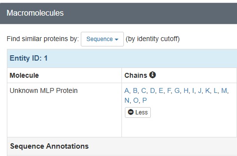

# Making of the Nuclear Pore Complex Basket
In this tutorial, we build an interactive story to explore the structure of the yeast nuclear pore complex (NPC) basket using integrative structural models. The story is based on the NPC structures 9A8N and 9A8M, which together capture the organization of the basket at the nuclear face of the pore. Step by step, we show how to load large assemblies, organize modular and flexible domains, and visualize how the basket is anchored to the nuclear ring and positioned to regulate nucleocytoplasmic transport.

## Assets
In this story we have ten assets: two structures with the PDB ID [`9A8N`](https://www.rcsb.org/structure/9A8N) and [`9A8M`](https://www.rcsb.org/structure/9A8M) and eight electron density files for the double membrane.

## Story-Wide Code
We begin by downloading the density files, storing them in an array and adjusting the isovalue to achieve a realistic membrane appearance suitable for visualization.

```javascript
const volumes = []
for (let i = 0; i < 8; i++) {
  const vol = builder
    .download({ url: `Yeast_C1_Double_MR_center_C8_${i}.bcif`})
    .parse({ format: 'bcif' })
    .volume()
  volumes.push(vol)  
}

const isovalue = 9;
```
In some later scenes, we will need to visualize only a single membrane region or a small subset of them, so the following function will help us to create represenation only for the required regions.

```javascript
// endIdx not included
function createMembraneRepr(startIdx, endIdx) {
  for (let i = startIdx; i < endIdx; i++) {
  const vol = volumes[i];
  vol
    .representation({
      type: 'isosurface',
      relative_isovalue: isovalue,
    })  
}
}
```
Now let's create both of our structures. Note that we can add any new property we need to the model, here it is PDB ID, so we can have access to it in the future scenes directly from the model.
```javascript
function structure(id) {
  let model = builder
    .download({ url: `${id}.bcif` })
    .parse({ format: 'bcif' })
    .modelStructure()

  model.pdbId = id.toLowerCase()
  return model;
}

const _9a8n = structure('9a8n')
const _9a8m = structure('9a8m')
```
We can move to the mapping the chain IDs to our proteins, so we can distinguish different structural parts in our visualization. For example, for structure 9A8N you can find this information in the [PDB](https://www.rcsb.org/structure/9A8N):



```javascript
const pdbIdToChainsMap = {
  '9a8m': {
    Mlp: ['A', 'B'],
    Nup1: ['C'],
    Nup2: ['D'], //show only proximal
    Nup60: ['F'] //show only proximal
  },
  '9a8n': {
    Mlp: `A B C D E F G H I J K L M N O P`.split(' '),
    Nup1: `Q R S T U V W X`.split(' '),
    Nup2: `Y AA AB AC AD AE AF AG AH AI AJ AK AL AM AN Z`.split(' '),
    Nup60: `AO AP AQ AR AS AT AU AV AW AX AY AZ BA BB BC BD`.split(' ')
  }
}

const proteinColors = {
  Mlp:   "#1b9e77",
  Nup1:  "#acfffc",
  Nup2:  "#f0e68c",
  Nup60: "#779ecb"
};

const nuclearRing = {
    Nup120: `BE, BF, BG, BH, BI, BJ, BK, BL, BM, BN, BO, BP, BQ, BR, BS, BT`.split(', '), 
    Nup85: `BU, BV, BW, BX, BY, BZ, CA, CB, CC, CD, CE, CF, CG, CH, CI, CJ`.split(', '), 
    Nup145C: `CK, CL, CM, CN, CO, CP, CQ, CR, CS, CT, CU, CV, CW, CX, CY, CZ`.split(', '), 
    Sec13: `DA, DB, DC, DD, DE, DF, DG, DH, DI, DJ, DK, DL, DM, DN, DO, DP`.split(', '), 
    Seh1: `DQ, DR, DS, DT, DU, DV, DW, DX, DY, DZ, EA, EB, EC, ED, EE, EF`.split(', '), 
    Nup84: `EG, EH, EI, EJ, EK, EL, EM, EN, EO, EP, EQ, ER, ES, ET, EU, EV`.split(', '), 
    Nup133: `EW EX EY EZ FA FB FC FD FE FF FG FH FI FJ FK FL`.split(' ')
}
```
We need to visually distinguish distal and proximal part of the nuclear ring. However, because the ring is very complex, instead of creating representations of each chain for each protein individually, it makes more sense to create only two selectors, for proximal and distal regions. After that we can simply apply one color for one region and another color for the another one.

```javascript
function createNuclRingSelectors() {
  let res = {
    proximal: [],
    distal: []
  }
  Object.entries(nuclearRing).forEach(([proteinName, chains]) => {
    chains.forEach((chainId, index) => {
      index % 2 == 0 ? res.proximal.push({label_asym_id: chainId}) : res.distal.push({label_asym_id: chainId})
    }
    )}
  )
  return res;
}

const nuclRingSelectors = createNuclRingSelectors()

function createNuclearRing(structure, options) {
  const opacityValue = options?.opacity ? options.opacity : 1;
  Object.entries(nuclRingSelectors).forEach(([name, sel]) => {
    structure
    .component({ selector: sel })
    .representation({
      ref: sel,
      type: 'surface',
      surface_type: 'gaussian'
       })
      .color({ color: name === 'proximal' ? "#ffb6c1" : "#fdd797" })
      .opacity({ opacity: opacityValue });
  }) 
}
```
Similarly, we create selectors for other proteins, so we can visualize them independently or combine them if necessary.
```javascript
function createProteinsSelectors() {
  const makeEntry = () => ({ Mlp: [], Nup1: [], Nup2: [], Nup60: [] });
  const res = Object.fromEntries(["9a8n", "9a8m"].map(k => [k, makeEntry()]));

  Object.entries(pdbIdToChainsMap).forEach(([pdbId, proteins]) => {
    Object.entries(proteins).forEach(([protein, chains]) => {
      chains.forEach((chainId) => {
        res[pdbId][protein].push({ label_asym_id: chainId })
      })
    })
  })

  return res;
}

const proteinSelectors = createProteinsSelectors()

function createProteinsRepr(structure, proteins, options) {

  Object.entries(proteinSelectors[structure.pdbId])
    .filter(([proteinName]) => proteins.includes(proteinName))
    .forEach(([proteinName, sel]) => {
      structure
        .component({ selector: sel })
        .representation({
          ref: proteinName,
          type: 'surface',
          surface_type: 'gaussian'
        })
        .color({ color: proteinColors[proteinName] });
      if (options?.labels) {
        lprimitives.label({
          position: { label_asym_id: pdbIdToChainsMap[structure.pdbId][proteinName][0] },
          text: proteinName,
          label_color: proteinColors[proteinName],
          label_size: 40
        });
      }
    });
}
```
Here we again map chains to the proteins but this time it is for another structural complex. To do that, we need to find out which proteins form this complex and which form distal/proximal regions. Positions of the labels are adjustable, so they are visible and are rendered at the correct spot. These positions are used later in **createNup84ComplexRepr** function.

```javascript
// NUP120: H, I; NUP85: J, K, L; SEC13: O, P
// NUP145C: M, N; SEH1: Q, R;  NUP84: S, T; NUP133: U, V; 
// 9a8m
const nup84Complex = {
  'proximal': {
    chains: `H J M O S Q U`.split(' '), 
    color: '#ffb6c1',
    labelAt: 'J',
    labelText: 'Proximal Nup84 complex'
  },
  'distal': {
    chains: `I K N P R T V `.split(' '), 
    color: '#fdd797',
    labelAt: 'P',
    labelText: 'Distal Nup84 complex'
  }
}

function createNup84ComplexSelectors() {
  let res = {
    proximal: [],
    distal: []
  }
  Object.entries(nup84Complex).forEach(([arm, data]) => {
    data.chains.forEach((chainId) => {
      res[arm].push({ label_asym_id: chainId })
    }
    )
  }
  )
  return res;
}

const nup84ComplexSelectors = createNup84ComplexSelectors()

function createNup84ComplexRepr(options) {
  const opacityValue = options?.opacity ? options.opacity : 1;

  Object.entries(nup84Complex).forEach(([armName, data]) => {
    _9a8m
      .component({ selector: nup84ComplexSelectors[armName] })
      .representation({
        ref: nup84ComplexSelectors[armName],
        type: 'surface',
        surface_type: 'gaussian'
      })
      .color({ color: data.color })
      .opacity({ opacity: opacityValue });
    if (options?.labels) {
      lprimitives.label({
        position: { label_asym_id: nup84Complex[armName].labelAt },
        text: data.labelText,
        label_color: data.color,
        label_size: 40,
      });
    }
  })
}
```

## Scene 1. The Story of the NPC Basket: A Gatekeeper with Hidden Complexity

<details>
<summary><strong>Markdown description</strong></summary>

```markdown
# 1. The Story of the NPC Basket: A Gatekeeper with Hidden Complexity

The nuclear pore complex (NPC) is not just a passive channel—it’s a dynamic hub for communication between the nucleus and cytoplasm. At its nuclear face lies the *NPC basket*, a structure long observed but only recently understood in structural and functional detail.

Through integrative modeling, we now reveal the architecture of the yeast NPC basket in unprecedented resolution.

This story unfolds the basket’s hidden complexity—showing how it is:
- **Anchored and assembled** at the nuclear ring,
- **Composed of flexible, modular domains**,
- **Tethered by nucleoporins** in a suspension-bridge-like configuration,
- And **positioned to regulate cargo transport and RNA quality control** within the nuclear landscape.

In this story, we’ll explore how form meets function in the NPC basket—and how this essential structure is not simply attached to the NPC, but integrated into its very logic.
```

</details>

In the first scene, we create a simple animation of the 9A8N structure. Having all the required functions for building in a story-wide code, we just call these functions for creating the representations of a membrane and proteins. We also create a button for navigating to the next scene, which has the 'B' key set in its **Scene options**.
```javascript
const anim = builder.animation({
  custom: {
    molstar_trackball: {
      name: 'rock',
      params: { speed: 0.15 }
    }
  }
});

createMembraneRepr(0, volumes.length)
createNuclearRing(_9a8n)
createProteinsRepr(_9a8n, ['Nup1', 'Nup2', 'Nup60', 'Mlp'])

const primitives = builder.primitives({
    label_attachment: 'middle-center',
    label_background_color: 'black',
    custom: {
        molstar_markdown_commands: {
            'apply-snapshot': 'B' // go to second scene
        }
    }
});

primitives.label({
    position: [0, -900, 500],
    text: 'Start Tour',
    label_size: 250.0,
    label_offset: 20.0   // Offset to avoid overlap with the residue  
  })
```

## Scene 2. The NPC Basket from the Cytoplasm

<details>
<summary><strong>Markdown description</strong></summary>

```markdown
# 2. The NPC Basket from the Cytoplasm

We begin with a view from the cytoplasm, looking into the central channel of the NPC. The cytoplasmic face reveals the organized radial symmetry of nucleoporins forming the core scaffold of the NPC. The central channel, devoid of large densities, hints at the dynamic and transient passage of cargoes. Beneath this ring structure, the basket extends deep into the nucleus.
```

</details>

In this scene, the transition duration is set to 3000 ms in the **Scene options**. The camera is pinned via the UI button in a more zoomed-in position. Here, in addition to the structure, we add labels to highlight key components. The **Mlp** label is animated so that it gradually becomes visible. To make this animation work, we assign a **ref** property to Mlp label and then reference it from the interpolate function, which controls the label’s appearance over time.

```javascript
const lprimitives = _9a8n.primitives({
  label_attachment: 'top-left',
  label_show_tether: true,
  label_tether_length: 2,
  label_background_color: 'black'
});

const anim = builder.animation({ });

createMembraneRepr(0, volumes.length)
createNuclearRing(_9a8n)
createProteinsRepr(_9a8n, ['Nup1', 'Nup2', 'Nup60', 'Mlp'])

builder.primitives({
  label_background_color: 'black',
  label_opacity: 0,
  ref: 'lbl_mlp'
}).label({
  position: [0, 0, -800],
  text: 'Basket',
  label_size: 100.0,
  label_color: '#1b9e77',
});

anim.interpolate({
  kind: "scalar",
  property: 'label_opacity',
  start_ms: 1000,
  end: 1,
  duration_ms: 2000,
  target_ref: 'lbl_mlp'
})

const selector = { label_asym_id: 'AS' };
lprimitives.label({
              position: selector,
              text: 'Anchor Nups',
              label_color: '#779ecb',
              label_size: 100
            });

builder.primitives({
  label_background_color: 'black'
}).label({
  position: [0, 900, 500],
  text: 'Cytoplasmic view',
  label_size: 150.0,
  label_offset: 20.0
});
```

## Scene 3. Side View: Anchoring and Architecture

<details>
<summary><strong>Markdown description</strong></summary>

```markdown
# 3. Side View: Anchoring and Architecture

A cross-sectional side view unveils the anchoring points of the NPC basket. The NPC is embedded in the double membrane of the nuclear envelope, with the nuclear ring just below. Hanging beneath this scaffold is the Mlp basket, a flexible, coiled-coil assembly of filaments that fan out into the nucleoplasm.
```

</details>

In this scene we have the same structure but from different angle (camera pin) and more labels, which have to be properly positioned.
```javascript
createMembraneRepr(0, volumes.length)
createNuclearRing(_9a8n)
createProteinsRepr(_9a8n, ['Nup1', 'Nup2', 'Nup60', 'Mlp'])

builder.primitives({
}).label({
  position: [0, 0, -900],
  text: 'Mlp Basket',
  label_size: 100.0,
  label_color: '#1b9e77'
});
  
  builder.primitives({
}).label({
  position: [-700, 0, -450],
  text: 'Basket',
  label_size: 120.0,
  label_color: '#1b9e77'
});

builder.primitives({
}).label({
  position: [-700, 0, 250],
  text: 'Nuclear envelope',
  label_size: 100.0,
  label_color: 'grey'
});

builder.primitives({
  label_background_color: 'black'
}).label({
  position: [0, 0, 600],
  text: 'Side view',
  label_size: 150.0,
});

builder.primitives({
}).label({
  position: [850, 0, -250],
  text: 'Nuclear ring',
  label_size: 100.0,
  label_color: '#fdd797'
});
```

## Scene 4. NPC as a Suspension Bridge​

<details>
<summary><strong>Markdown description</strong></summary>

```markdown
# 4. NPC as a Suspension Bridge​

The NPC basket architecture remarkably mirrors that of a suspension bridge. In this analogy, **Nup60** acts as the *suspension cable*, extending horizontally and linking the **Mlp proteins** to the **nuclear ring** via a complex meshwork involving **Nup1** and **Nup2**.​

**Nup60**, positioned at the nuclear ring, spans laterally and recruits **Nup2** and **Nup1**, functioning like hangers that connect the suspension cable to the basket’s vertical support.​

**Nup2**, attaches to Nup60 and nuclear ring, forms an interaction hub. It plays both structural and regulatory roles in basket assembly and transport functions.​

**Nup1** resides on the periphery, modulating the dynamics of the basket and interacting with cargo complexes during mRNA export.
```

</details>
Here we create another structure, 9A8M, and add labels directly to its proteins. Note that here we need only one region of the membrane.
```javascript
// required for createProteinsRepr with labels on
const lprimitives = _9a8m.primitives({
  label_attachment: 'top-left',
  label_show_tether: false,
  label_tether_length: 2,
});

createMembraneRepr(0, 1)
createNup84ComplexRepr({ opacity: 0.5 })
createProteinsRepr(_9a8m, ['Nup1', 'Nup2', 'Nup60', 'Mlp'], { labels: true })

builder.primitives({
  label_background_color: 'black'
}).label({
  position: [0, 0, 350],
  text: 'Central channel view',
  label_size: 150.0,
  label_offset: 20.0
});
```

## Scene 5. Integration of Scaffold and Basket​

<details>
<summary><strong>Markdown description</strong></summary>

```markdown
# 5. Integration of Scaffold and Basket​

The core **Nup84 complex** scaffold attaches itself to the nuclear
membrane. The **distal and proximal arms** of the Nup84 complex
serve as attachment points for anchor Nups and thus indirectly link
to the basket. These interactions reinforce the notion that the
basket is not an appendage but an integrated and essential
extension of the NPC scaffold.
```

</details>

In this scene, there is a focus on **Nup84 complex** and its two arms, proximal and distal, so we add labels for them.
```javascript
// required for createNup84ComplexRepr with labels on
const lprimitives = _9a8m.primitives({
  label_attachment: 'top-left',
});

createMembraneRepr(0, 1)
createNup84ComplexRepr({ labels: true })

builder.primitives({
}).label({
  position: [14, 347, -80],
  text: 'Nuclear membrane',
  label_size: 40.0,
  label_color: 'grey'
});
```

## Scene 6. Structural Summary

<details>
<summary><strong>Markdown description</strong></summary>

```markdown
# 6. Structural Summary

This integrative model reveals how three key anchor proteins—**Nup1**, **Nup2**, and **Nup60**—coordinate the spatial organization of the basket.​

**Nup60** tethers the basket filaments to the nuclear ring.​

**Nup2** acts as a linker and signal integrator.​

**Nup1** extends the interface toward the nuclear interior and likely modulates transport and surveillance functions.
```

</details>

Here, we add labels to all rendered proteins and adjust the opacity for the better appearance.
```javascript
// required for createNup84ComplexRepr and createProteinsRepr with labels on
const lprimitives = _9a8m.primitives({
  label_attachment: 'top-left',
});

createMembraneRepr(0, 1)
createNup84ComplexRepr({ opacity: 0.4, labels: true })
createProteinsRepr(_9a8m, ["Nup1", "Nup2", "Nup60"], { labels: true })

builder.primitives({
}).label({
  position: [14, 347, -80],
  text: 'Nuclear membrane',
  label_size: 40.0,
  label_color: 'grey'
});
```

## Scene 7. Basket Flexibility and Composition

<details>
<summary><strong>Markdown description</strong></summary>

```markdown
# 7. Basket Flexibility and Composition

Zooming in, the flexible Mlp filaments in the nuclear basket exhibit a coiled-coil organization at their central region, anchored to the nuclear ring. Their **N-terminal (blue)** and **C-terminal (red)** regions, located at the distal end of the basket, are disordered and form a dynamic ring structure that likely contributes to the regulation of mRNA export and quality control.
```

</details>

In this scene, we focus on **Mlp** proteins and create selectors for their N-terminal and C-terminal parts. To apply **colorFromSource** method, we create a separate representation for Mlps and exclude it from **createProteinsRepr**. 
```javascript
// required for createNup84ComplexRepr and createProteinsRepr with labels on
const lprimitives = _9a8m.primitives({
  label_attachment: 'top-left',
});

createMembraneRepr(0, 1)
createNup84ComplexRepr({ opacity: 0.4, labels: true  })
createProteinsRepr(_9a8m, ['Nup1', 'Nup2', 'Nup60'], { labels: true })

const nTermSelector = { label_asym_id: 'B', label_seq_id: 1 };
const primitives = _9a8m.primitives({
  label_attachment: 'top-right',
  label_show_tether: true,
  label_tether_length: 2
});
primitives.label({
              position: nTermSelector,
              text: 'Mlps N-term',
              label_color: 'blue',
              label_size: 30
            });

const cTermSelector = { label_asym_id: 'A', label_seq_id: 1875 };
primitives.label({
              position: cTermSelector,
              text: 'Mlps C-term',
              label_color: 'red',
              label_size: 30
            });

const mlps = _9a8m
   .component({ selector: [{ label_asym_id: 'A' }, { label_asym_id: 'B' }] })
   .representation({ type: 'spacefill' });

mlps.colorFromSource({
   schema: 'all_atomic',
   category_name: 'ihm_sphere_obj_site',
   field_name: 'seq_id_begin',
   field_remapping: {
     beg_label_seq_id: 'seq_id_begin',
     end_label_seq_id: 'seq_id_end',
   },
   palette: {
     kind: 'continuous',
     colors: 'Chainbow',
   },
});
```

## Scene 8. Conclusion

<details>
<summary><strong>Markdown description</strong></summary>

```markdown
# 8. Conclusion

This integrative model of the yeast NPC basket transforms our understanding from a passive structural extension into an **active, anchored, suspension-bridge-like module**. The coordinated action of Nup60, Nup2, and Nup1, along with the intricate Mlp architecture, reveals a sophisticated system engineered for flexibility, function, and regulation—essential for nucleocytoplasmic transport and RNA quality control.
```

</details>

In the last scene, we again render our first structure 9A8N with only five sections of membrane. This is done primarily for a better visualization of the proteins.
```javascript
// required for createProteinsRepr with labels on
const lprimitives = _9a8n.primitives({
  label_attachment: 'top-left',
  label_show_tether: false,
  label_tether_length: 2,
  label_background_color: 'black'
});

createMembraneRepr(2, volumes.length - 1)
createNuclearRing(_9a8n, { opacity: 0.5 })
createProteinsRepr(_9a8n, ['Nup1', 'Nup2', 'Nup60', 'Mlp'], { labels: true})

_9a8n.component()
.focus({ direction: [0,-1,0], up: [0,0,1] })
```